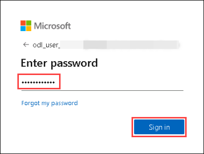
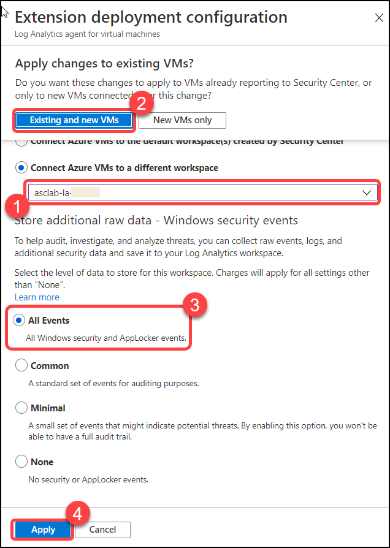

# Module 1 – Getting started with the Environment

### Overview

In this exercise, you will learn how to enable Azure Defender in your subscription

You will be performing the following activities to achieve the goal.

* Login to Azure Portal to access your subscription
* Upgrade your subscription to enable Azure Defender Plan
* Configure data collection in ASC

## Exercise 1: Log in to Azure Portal

### Instructions 

1. On the left side of the screen, a virtual machine (JumpVM) is already loaded. You have to use this virtual machine throughout the workshop to perform the lab. If you are unable to view the Virtual Machine, check if the virtual machines are running by navigating to the Virtual Machines tab on the top right of the lab guide. Also, you can directly RDP into the Virtual Machine using the Details of labvm provided in the Environment Details tab.

2. To get the lab environment details, you can select the **Environment Details** tab. Additionally, the credentials will also be emailed to your email address provided at registration. 

3. You can also open the Lab Guide on Separate full window by selecting the **Split Window** icon in the bottom right corner. 

### Login to Azure Portal 

1. In the JumpVM, Launch Azure Portal using the shortcut available on the desktop.  

2. On the **Sign into Microsoft Azure** tab, you will see the login screen, enter the following email/username, and, then click on **Next**.  

   * Email/Username: <inject key="AzureAdUserEmail"></inject> 

    

3. Now enter the following password and click on **Sign in**. 

   * Password: <inject key="AzureAdUserPassword"></inject> 

    

4. If you see the pop-up **Stay Signed in?**, click on No 

5. If you see the pop-up **You have free Azure Advisor recommendations!**, close the window to continue the lab. 

6. If a **Welcome to Microsoft Azure** popup window appears, click **Maybe Later** to skip the tour.

## Exercise 2: Enabling Azure Defender

### Subscription upgrade and agents installation
1. On the **Azure Portal** top search bar search for **Security Center** and click to open.

2. Click on the **Getting started** page from the left pane, On the **Upgrade** Tab, select your subscription and press **Upgrade**.

3. Click on **Install agents**, if the button has been grayed out, then it's already set to **On**.

4. Return to Azure security Center blade and Click on **Pricing & settings**.

5. Your subscription should be listed and the Azure Defender plan should be **On** (if it does not, close your browser session and open a new one).

> Notice that you enabled Azure Defender at a subscription level, but Log Analytics workspace pricing is still set Off (means Azure Defender is OFF).

### Configure the data collection settings in ASC
1. On the **Azure Portal** top search bar search for **Security Center** and click to open.

2. Click on the **Pricing and Settings** page from the left pane, select Log Analytics workspace named **asc-lab-{DeploymentID}**

    **Note**: Deployment ID can be obtained from the Lab Environment Details Tab.

2. On the Azure Defender Plans page, select **Azure Defender on** and click **Save**. Now both subscription and Log Analytics workspace should be set to **On** for the Azure Defender plan.

3. Go back to the **Pricing & Setting** and drill down into your **Azure subscription**.

4. Navigate to **Auto provisioning**

5. On the **Auto provisioning - Extensions** page, set **Log Analytics agent for Azure VMs** to **On** (if it's not already set to On)

6. Click **Edit configuration**.

7. On the workspace configuration section, use the **Connect Azure VMs to a different workspace** option to select your workspace **asc-lab-{DeploymentID}**.

8. When **Apply changes to existing VMs** popup prompted select **Existing and new VMs**.

8. Under **Store additional raw data - Windows security events** section, select **All Events** option.

9. Click on **Apply**.

10. Click on **Save**.

 

> Please notice:
> * To get the full functionality of Azure Security Center and Azure Defender, both subscription and Log Analytics workspace should be enabled for Defender. Once you enable it, under the hood the required Log Analytics solutions will be added to the workspace.
> * Before clicking on the Upgrade button, you can review the total number of resources you are going to enable Azure Defender on.
> * You can enable Azure Defender trial for 30-days on a subscription-only if not previously used.
> * To enable Azure Defender on a subscription, you must be assigned the role of Subscription Owner, Subscription Contributor, or Security Admin.

### Summary

  In this module, you have learned how to enable Azure Defender. Now you can move on to the next module by clicking on the Next button at the bottom right of the page.
