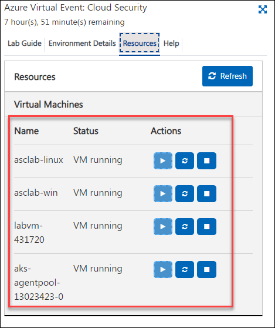
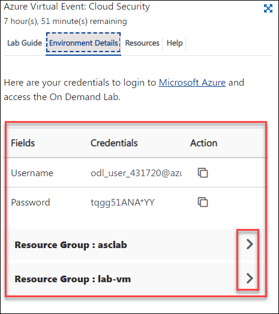
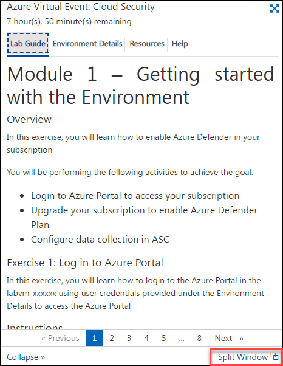
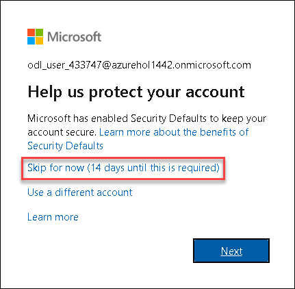
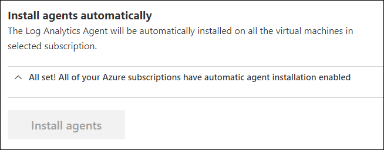
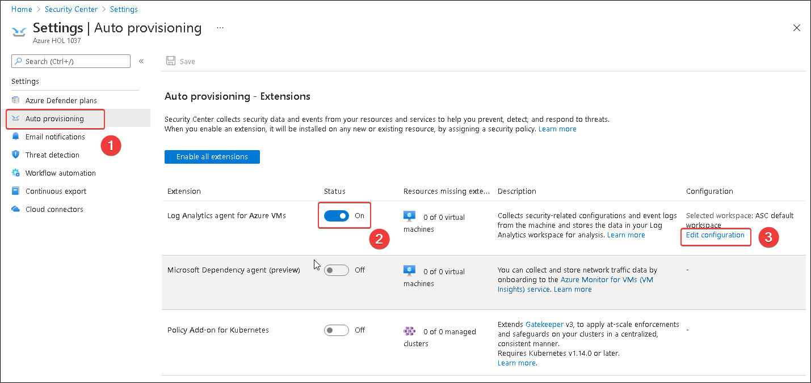

# Module 1 – Getting started with the Environment

## Overview

In this exercise, you will learn how to enable Azure Defender in your subscription

You will be performing the following activities to achieve the goal.

  - Login to Azure Portal to access your subscription
  - Upgrade your subscription to enable Azure Defender Plan
  - Configure data collection in ASC

## Exercise 1: Log in to Azure Portal

In this exercise, you will learn how to login to the Azure Portal in the labvm-xxxxxx using user credentials provided under the Environment Details to access the Azure Portal

### Instructions 

1. After the environment is provisioned successfully your browser will load up the **Lab Guide** along with a virtual machine called **labvm-<inject key="DeploymentID" enableCopy="false"/>**. This virtual machine will be your platform throughout the course of the workshop. In case you do not see the **labvm-<inject key="DeploymentID" enableCopy="false"/>** load up on the left side of the screen, navigate to the **Virtual Machines** tab on the top right of the **Lab Guide** and check the status of the virtual machine. Alternately, you can directly RDP into labvm using the credentials provided in the **Environment Details** tab.

   

2. All user credentials for accessing the **Azure Portal** can be viewed under the **Environment Details** tab for ease of access. Do note that the same information will also be sent to your registered email address. 

   

3. The Lab Guide can also be opened on a separate window by selecting the **Split Window** icon in the bottom right corner. This will result in the window detaching from the right side providing more on-screen space for your virtual machine.

   

### Login to Azure Portal 

1. In the **labvm**, Launch **Azure Portal** using the desktop icon.  

2. Now you should be on the **Microsoft Azure** login screen. Enter the following username and click on **Next**.  

   * Email/Username: <inject key="AzureAdUserEmail"></inject> 

    

3. Enter the following password and click on **Sign in**. 

   * Password: <inject key="AzureAdUserPassword"></inject> 

    

4. You may get a **Help us protect your account** box, on that click on **Skip for now (14 days untill this is required)** and then click on **Next** button.

    
 
5. First-time users are often prompted requesting access to **Stay Signed in**. If you see any such pop-up window, click on **No**.

6. If you see any additional pop-up like, You have free **Azure Advisor recommendations!** Close the window to continue the lab. 

## Exercise 2: Enabling Azure Defender

In this exercise, you will be getting started with the functionality of Azure Security Center and Azure Defender and how to enable Azure Defender on a subscription.

### Subscription upgrade and agents installation

1. Type **Security Center** in the search box on top of the **Azure Portal** and click to open it.

2. Click on the **Getting started (1)** from the left pane. Click on the **Upgrade (2)** tab, select your **subscription (3)** and click **Upgrade (4)**.

   > **Note:** If you are not able to see subscription then it means your subscription is already upgraded, in this case you can skip step 2, 3 and continue from step 4.

   

   

3. Click on **Install agents**. 

   
   
   > **Note:** If the button is greyed out, then it's already set to **On** and agents are already installed in this case you can move on to the next step.

   

4. Return to Azure security Center blade and Click on the **Getting started (1)** from the left pane. Click on the **Install agents (2)** tab, Click on **Pricing & settings page (4)**.

   

5. Your subscription should be listed here and the **Azure Defender plan** should appear **On**.

### Configure the data collection settings in ASC

1. In **Pricing and settings** present under **Management** section, select the Log Analytics workspace named **<inject key="log analytics workspace" props="{\&quot;enableCopy\&quot;:true,\&quot;style\&quot;:{\&quot;fontWeight\&quot;:\&quot;bold\&quot;}}" />**

   

2. On the **Settings |Azure Defender Plans** page, select **Azure Defender on** and click **Save**. Now both subscription and Log Analytics workspace should be set to **On** for the Azure Defender plan.

   

3. Go back to the **Security center | Pricing & settings** page and select your **Azure subscription**.

4. From **Settings |Azure Defender Plans** page, Navigate to **Auto provisioning (1)** under the Settings section.

5. On the **Settings | Auto provisioning** page under the **Auto provisioning - Extensions** header, toggle the status of **Log Analytics agent for Azure VMs (2)** to **On** (if it is not already set to On)

6. Click on **Edit configuration (3)** under the **Configuration** header of Log Analytics agent for Azure VMs extension. A new window of Extension deployment configuration is opened.

  

7. On the **Extension deployment configuration** blade under the **Workspace configuration** section, select the **Connect Azure VMs to a different workspace (1)** option and then select your workspace **asclab-la-{DeploymentID} (2)** from the drop down menu.

   

8. When **Apply changes to existing VMs?** popup window is prompted, select **Existing and new VMs**.

   

9. Next, under the **Store additional raw data - Windows security events** section, select the **All Events** option.

    

10. Click on **Apply**.

11. Once all the configurations are made, click on **Save** on the Settings | Auto provisioning page.

 

> Please notice:
> * To get the full functionality of Azure Security Center and Azure Defender, both subscription and Log Analytics workspace should be enabled for Defender. Once you enable it,  the required Log Analytics solutions will be added to the workspace.
> * Before clicking on the Upgrade button, you can review the total number of resources you are going to enable on Azure Defender.
> * You can enable the Azure Defender trial for 30-days on a subscription-only, if not previously used.

## Exercise 2: Creating ASC Default policy.

In this exercise, You will create the ASC default policy in security policy under  Securiy Center.

1. From Azure Portal, search for **security center** and select it.

1. In Azure security Center blade and Click on the **Getting started (1)** from the left pane. Click on the **Install agents (2)** tab, Click on **Pricing & settings page (4)**.

   
   
1. 1. In **Environment Settings** page, Select your subscription.

   
   
1. You'll notice that the **ASC Default policy** has been created automatically. Explore the policy by clicking on the policy.

   
    
## Summary

  In this module, you have learned how to enable Azure Defender. Now you can move on to the next module by clicking on the Next button at the bottom right of this page.
