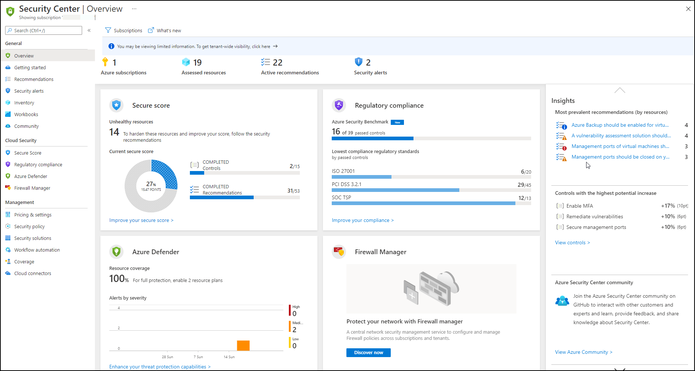
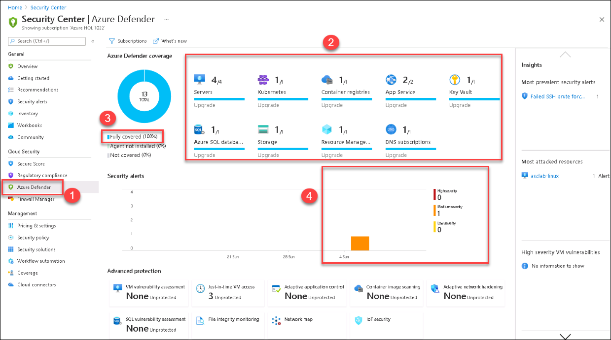
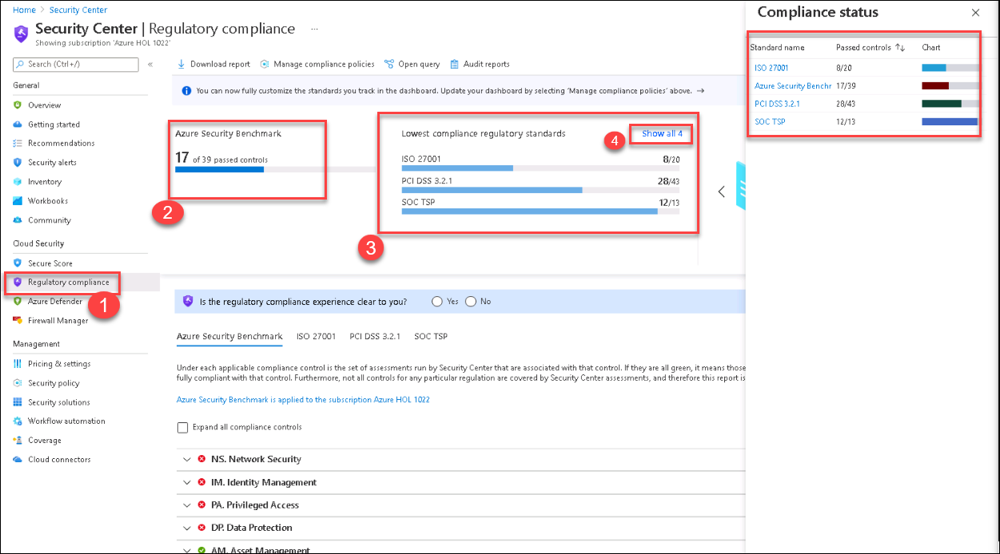
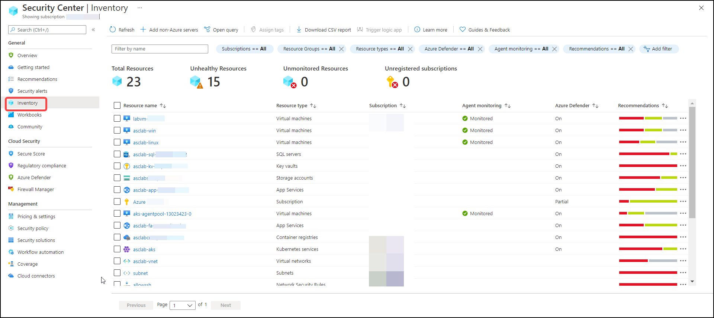
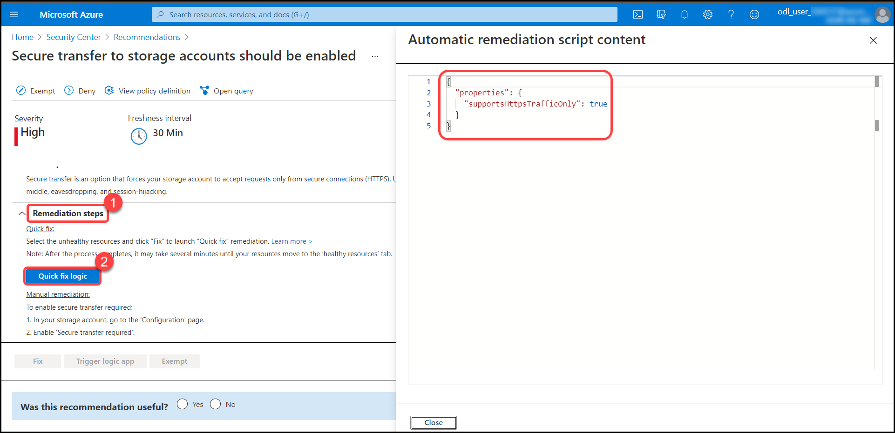
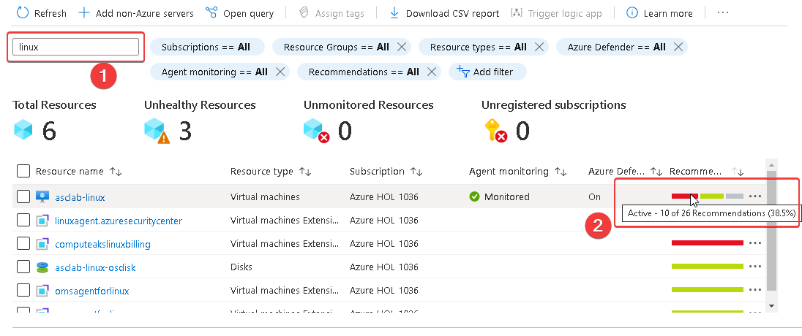
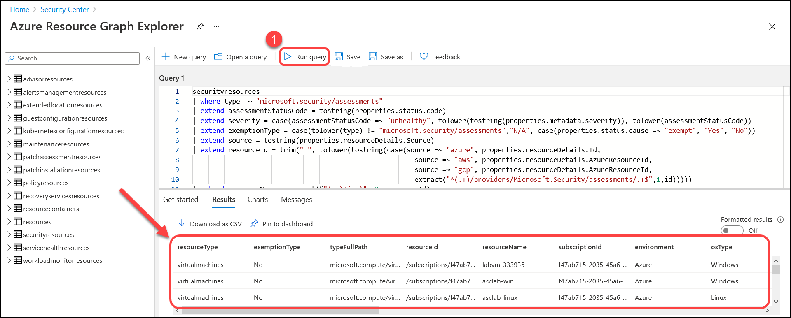

# Module 2 - Exploring Azure Security Center

### Overview

In this exercise, you will explore the Azure Security Center Dashboard features overview.

You will be performing the following activities to achieve the goal.

* Overview of Security Center dashboard features **Azure Secure Score, Regulatory Compliance and Azure Defender**.
* Exploring Security Controls and Recommendations
* Exploring the Inventory capability

### Exercise 1: Understanding Azure Security Center dashboard

In Azure Security Center, You will be interacting with the Security Center dashboard which provides a unified view into the security posture of your hybrid cloud workloads. Additionally, it shows security alerts, coverage information, and more.

1. Launch **Azure Portal** using the desktop icon on the JumpVM and login with the Azure credentials from the Lab **Environment Details** tab if not logged in already.

2. Type **Security Center** in the search box located on the top of the **Azure Portal** page and click to open it.

3. The Security Center Overview page provides a unified view for security professionals. This page contains detailed insights on the security posture on its dedicated dashboard and includes multiple independent cloud security pillars such as- **Secure Score, Regulatory Compliance and Azure Defender**.

> ❗ Important: <br>
> It takes few minutes for all tiles on the Overview Page to update.

  

4. Note that the **Subscriptions** icon on the **top menu bar** allows you to view and filter subscriptions. In this lab, we will use only one subscription, but for your reference, selecting different/additional subscriptions will adjust the interface to reflect the security posture for the specified subscription.

   

5. Click on the **What’s new** button – a new tab will open with the latest release notes where you can stay updated on the new features, bug fixes and more.

   

6. Note the **high-level numbers** at the top menu; This view allows you to see a summary of your **Azure subscriptions, Assessed resources, Active recommendations and Security alerts.**

   

7. From the top menu bar, **click** on **Azure subscriptions**.

8. On the **Coverage** page, note that your Subscription is listed under the **Fully covered** tab – which means that your subscription is covered by Azure Defender. (you should also see a message: *Looking good! The subscriptions below are fully protected*)

   

> ⭐ Good to know: <br>
> This page shows a list of subscriptions and their coverage type. You can use this page to find subscriptions that are not covered by Azure Security Center and identify “shadow IT” subscriptions.

9. Go back to the **Overview** page, and look at the **Secure Score** tile, you can see your current score along with the number of **Completed controls and Completed recommendations**. Clicking on this tile will redirect you to drill down view across subscriptions.

   

> ⭐ Good to know: <br>
> The higher the score, the lower the identified risk level.

10. From the **Security Center** page Select the  **Azure Defender** from the **Cloud Security** section.

11. On the **Azure Defender** tile, you can see the coverage of your connected resources(2) for the currently selected subscription and the recent **security alerts**(4), color-coded by severity. Your current resource coverage should be fully covered **100%**(3) which means **full protection**. Clicking on this tile will redirects you Azure Defender dashboard.

    

12. Next, select the **Regulatory Compliance** from the **Cloud Security** section of the Security Center page.

13. On the **Regulatory Compliance** tile, you can get insights into your compliance posture based on continuous assessment of both Azure and hybrid cloud environments. This tile shows the following standards which are **Azure Security Benchmark, ISO 27001, PCI DSS 3.2.1 and SOC TSP**. Click on **Show all 4** to check the compliance status.
 
 >Clicking on this tile will redirect you to the Regulatory Compliance dashboard – where you can add additional standards and explore the current ones.

   
   
14. Next Click on **Inventory** from the **General** section of the Security Center.

15. The next tile on the overview page is the **Assessed resources** which is essentially the **Inventory** – it shows the number of unmonitored VMs alongside the total covered resources - **you should expect to have zero unmonitored VMs**.
Resources are divided by their health status. Clicking on this tile will redirects you to the asset inventory dashboard where you can explore your resource and their security posture – see a dedicated exercise below.

> ❗ Important: <br>
> Unmonitored VMs are considered as virtual machines that have Log Analytics agent deployed, but the agent isn't sending data or has other health issues.





### Exercise 2: Exploring Secure Score and Recommendations

**Exploring Secure Score**

Previously, we explored the Secure Score tile on the overview page. Now let’s dive into this capability and the associated recommendations. Azure Security Center mimics the work of a security analyst, reviewing the security recommendations and applying advanced algorithms to determine how crucial each recommendation is. Azure Security Center constantly reviews the active recommendation and calculates the score based on them. All findings are aggregated into a single score (Secure Score) which measures your current security posture of your subscription/s; the higher the score, the lower the identified risk level.
Exploring secure score

1.	Type **Security Center** in the search box located on the top of the **Azure Portal** page and click to open it.

2.	From the left navigation pane, under the **Cloud Security** section, Select the **Secure Score** button.

3.	On theSecurity Center | Secure Score page, review your current **Overall Secure Score**.

> ⭐ Notice: <br>
> The score is shown as a percentage value, you can also see the points based on which the score is calculated, next to the percentage. See the following example:
> 
> 
> 
> For more information on how the score is calculated, [refer to the secure score documentation page](https://docs.microsoft.com/en-us/azure/security-center/secure-score-security-controls#how-your-secure-score-is-calculated).

4. Again on the Security Center | Secure Score page observe the tile **Subscriptions with the lowest scores** – this section helps in prioritizing work on the subscriptions. Since this demo is based on a single subscription, you will see only one.

   

5. The bottom section lists the subscriptions and their current secure scores. To view the recommendations behind the score, click on **View recommendations**.
  
   

**Exploring Security Controls and Recommendations**

1. Type **Security Center** in the search box located on the top of the **Azure Portal** page and click to open it. From the left navigation pane, under the **General** section, Select the **Recommendations** button.

2. On the recommendations page, pay attention to the first part of the page; the **summary view**. It includes the current **Secure Score**, progress on the **Recommendations status**(both completed security controls and recommendations) and **Resource health** (by severity).

   

3. From the top menu, click on the **Download CSV report** button – this allows you to get a snapshot of your resources, their health status and the associated recommendations. You can use this file for pivoting and reporting.

4. The second part of the page contains a list of all recommendations grouped by security **Controls**:

> ⭐ Notice: <br>
> -	Each security control is a logical group of related security recommendations and represents a "security risk" that you should prioritize and mitigate.
> -	Each control has its own score which contributes to the overall secure score.
> -	Address the recommendations in each control, focusing on the controls worth the most points.
> -	To get the max score, fix all recommendations for all resources in a control.
> To understand how the score and the downstream recommendations are calculated, please visit our official [documentation](https://docs.microsoft.com/en-us/azure/security-center/secure-score-security-controls#calculations---understanding-your-score "Understanding your score calculation").

5. On the right side, switch the toggle button of **Group by Controls** to **OFF** to disable the group by controls view – now you should get a flat view of all recommendations. After viewing all the recommendations switch it back to **ON**.


6. Look for the **Encrypt data in transit** security control under the **Controls**. You may have to scroll down to view it.

7. Notice its max score is around 4 and the potential increase for the score. You should have more than three recommendations within this control.

    **Note**: It takes few hours for all the data to be loaded, In case if you don't see the above option in the list that means it is not populated yet in the recommendations. You can continue to the next exercise and verify this after some time

8. Search for the **Secure transfer to storage accounts should be enabled** recommendation and select it.

   
   
> ⭐ Notice: <br>
> You can observe for few recommendations Quick Fix option is also available. Quick Fix allows you to remediate a group of resources quickly whenever possible with a single click. This option is only available for supported recommendations and enables you to quickly improve your secure score and increase the security in your environment.

9. On the top section, notice the following:

- Title of the recommendation: **Secure transfer to storage accounts should be enabled**
- Top menu controls: **Exempt**, **Deny**, **View policy definition** and **Open query**
- Severity indicator: **High**
- Freshness interval: **30 Min** 


10. The next important part is the **Remediation Steps** which contains the remediation logic where you can remediate the selected resource/s either by following the step-by-step instructions, use the provided ARM template in the next step, or REST API to automate the process.

11. Expand the **Remediation Steps** menu on the **Secure transfer to storage accounts should be enabled** page and Click on the **Quick fix logic**, notice the automatic remediation script content (ARM Template) as shown below:

```json
{
  "properties": {
    "supportsHttpsTrafficOnly": true
  }
}
```
   

12. Close the template window, in the bottom section, **select a resource** (the single storage account on the **Unhealthy resources** tab of **Affected resources**) and click on **Fix** this will open a new window of **Fix resources**.

13. On the right pane, review the implications for this remediation and press **Fix 1 resource**.

14. Wait for a notification: ✅ **Remediation successful** - Successfully remediated the issues on the selected resources. Note: It can take several minutes after remediation completes to see the resources in the 'healthy resources' tab.

> **Info**: In the recommendation list, you can now see few recommendations flagged as in preview. Those aren’t included in the calculation of your score. They should be still remediated so that when the preview period ends, they will contribute towards your final score.

### Exercise 3: Exploring the Inventory capability

Asset inventory dashboard allows you to get a single pane of glass view to all your resources covered by Azure Security Center. It also provides per-resource visibility to all Security Center’s information and additional resource details including security posture and protection status. Since this dashboard is based on Azure Resource Graph (ARG), you can run queries across subscriptions at a large scale, quickly and easily.

1. Type **Security Center** in the search box located on the top of the **Azure Portal** page and click to open it. From the left navigation pane, under the **General** section, select the **Inventory** button.

2. Hover to the **Summaries strip** at the top of the page.

   

   **Note**: In your environment, these numbers may not be the same, since it varies in time

3. Notice the total number of resources, The total number of resources are the ones that are connected to the Security Center and NOT the total number of resources that you have in your subscriptions.

4. Notice the number of **unhealthy resources**, The unhealthy resources are the resources with actionable recommendations based on the selected filter.

5. Notice the **unmonitored resources**, The unmonitored resources indicate if there are resources with Log Analytics agent deployed but with health issues. Since we enabled the auto-provisioning in the previous module, all existing VMs are covered and connected, which means they are monitored.

6. Use the **Filter by name** box to search for **linux**. You should now see a filtered view containing your desired resource: **asclab-linux**

7. Hover on the red bar in the **recommendations** column to see a tooltip with the active recommendations.. You should expect to see **Active-xx of xx Recommendations** – these are the active recommendations you must attend.

   

8. Open the resource health pane by selecting the resource. Click on **asclab-linux**. Alternately. you can also right-click on any resource and select **view resource**.

   

9.	On the resource health pane for **asclab-linux**, review the virtual machine information alongside the recommendation list.

    

    **Note**: It will take few hours for all the recommendations to get loaded.

10. Go back to the Inventory page and clear the search keyword **linux**. Then from the filter menu, select the **Resource Group** filter and then provide the value **asclab-aks** (Unselect remaining). Using this filter, you can see all resources related to the predefined Kubernetes resources which are monitored with active recommendations.

    

> Notice! The entire grid can be filtered and sorted

11.	From the filter menu, select the **Resource Group** filter and **select all** under the Value. Again from the filter menu, select **Recommendations**, uncheck the **select all** option under the Value and then select the **Auditing on SQL Server should be enabled** and click on **Ok**. You can also use the search area within the filter to better find across the list. When you are done exploring remember to clear your filter.

    **Note**: If you don't see **Auditing on SQL Server should be enabled** in search that means it is not loaded yet to recommendations, Note down this step number and verify this after some time.

12.	Tags are a very common asset management feature within Azure. With the help of this feature, resources can be tagged using a Tag name and value. These assigned tags can organize your assets and categorize them with the help of filters. Let us now assign the following Tags:

* Filter the **Resource type** column to include only **App Services**: Select the **Resource type** filter and select **app services** under the Value and Click on **OK**
* **Select** the checkboxes of the two app services named *asclab-fa-xx* and *asclab-app-xx*. (Here **xx** is the unique id of resource).
* From the top menu, click **Assign tags**
* Assign `Environment` as the name and  `Production` as the value.
* Click **Save**.

    **Note**: If you don't see App Services in Resource type filter that means it is not loaded yet to recommendations, Note down this step number and verify this after some time.

    

13. From the filter pane, remove the **Resource type** filter then go to add filter and notice the **Security findings** filter – it allows you to find all resources that are prone to a specific vulnerability. You can also search for CVE, KB ID, name and missing update.

14. From the filter pane, remove the **Security findings** filter if you added in the previous step then select **Azure Defender** filter and set value to **On** and click on **OK**. On the **Resource Group** select **asclab** (Unselect remaining) and again Click on **Ok**

    

15. From the top menu bar, click on **Download CSV report**. You will get a snapshot to work on it offline already filtered. You can also right-click on any of the resources and upgrade to Azure Defender plan (when applicable).

16. From the top menu, click on **Open query**.

    

17. On the **Azure Resource Graph Explorer** blade, click on **Run Query**. You should now have the same list of resources and columns as in the previous step. This query is editable for your needs and here it gets very powerful.
 
    

18. Save the query for later use by clicking on **Save as** from the top menu. You can use it to create periodic reports. Name the report as *asc-filtered-query* and select **save**.

> ⭐ Good to know: <br>
> The Inventory dashboard is fully built on top of Azure Resource Graph (ARG) which stores all of ASC security posture data and leveraging its powerful KQL engine.
> It enables you to reach deep insights quickly and easily on top of ASC data and cross-reference with any other resource properties.

### Summary

  In this module, you have explored **Azure Security Center dashboard**, **Secure Score and Recommendations** & **Inventory capability**. 
  
  Now you can move on to the next module by clicking on the Next button at the bottom right of this screen.
