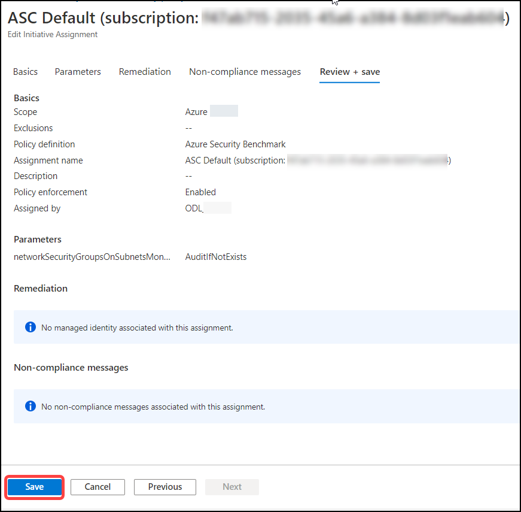
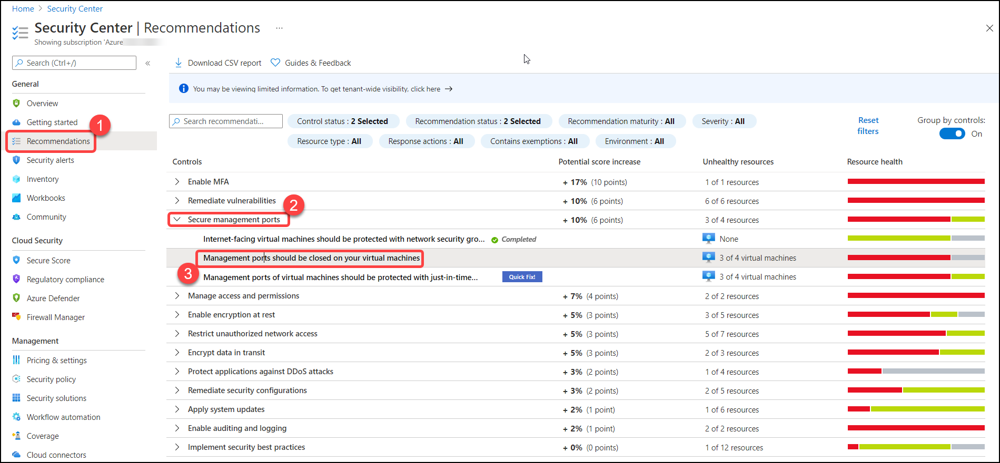
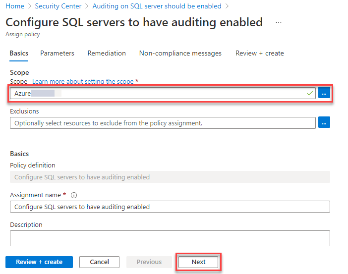
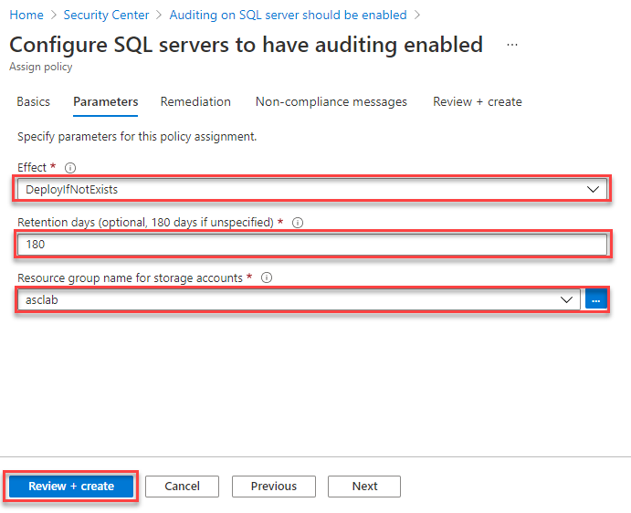
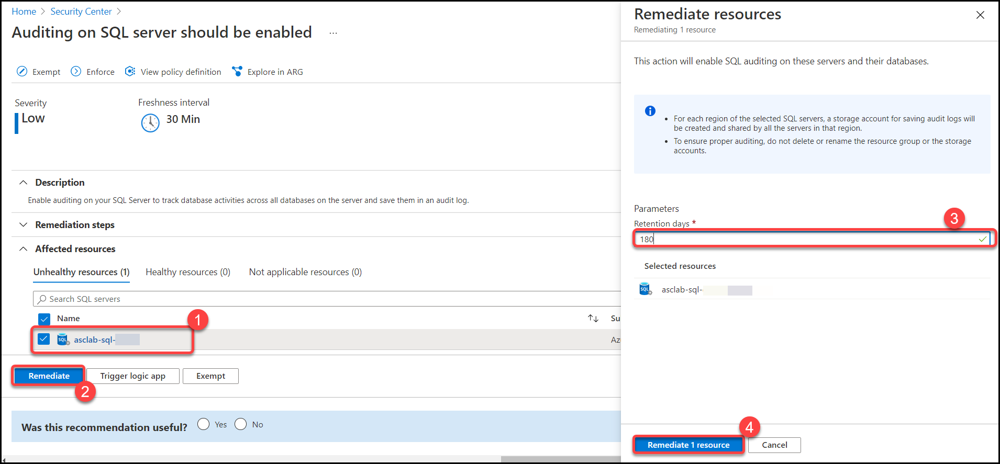
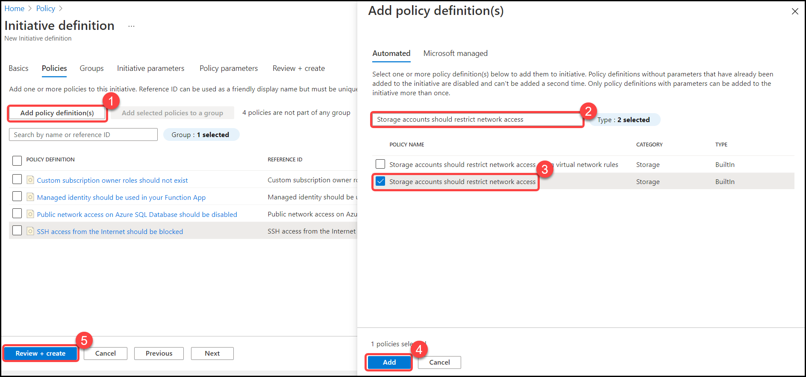
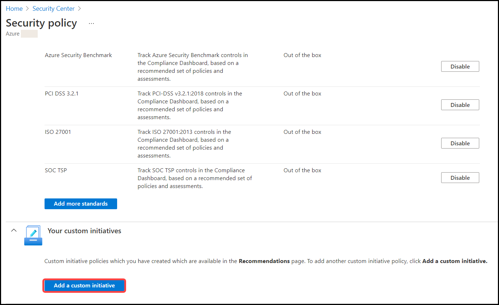

# Module 3 - Security Policy

## Overview

The exercises in this module will guide you through the current Security Center policies, based on Azure Policy, and show you where to enable or disable Security Center policies.

### Exercise 1: Overview of the ASC policy

1.	Click on the Azure Portal icon on the JumpVM and login with the Azure credentials from the Lab Environment output page.

2.	On the Security Center blade, from the left navigation, pave, click on **Security policy**.

2.	On the Policy Management page, select **Azure subscription**.

3.	As you can see on the top part, there is 1 assignment at the **Security center default policy** which is ASC default.

Note: This is the default policy for Azure Security Center recommendations which is enabled by default on your subscription. This is the default set of policies monitored by Azure Security Center. It was automatically assigned as part of onboarding to Security Center. The default assignment contains only audit policies. For more information please visit https://aka.ms/ascpolicies

4.	To view the policy, click on **ASC Default**.

5.	On the selected scope (Azure subscription 1 with 1 security policy assignment), you can see overall effective policies in Security Center.

6.	As you can see, policies are set to different effects based on the order of evaluation:

Effect | Description
------ | -------- | 
**Disabled** | This effect is useful for testing situations or for when the policy definition has parameterized the effect. This flexibility makes it possible to disable a single assignment instead of disabling all of that policy's assignments.
**Audit** | Audit is used to create a warning event in the activity log when evaluating a non-compliant resource, but it doesn't stop the request.
**AuditIfNotExists** | AuditIfNotExists enables auditing of resources related to the resource that matches the if condition but doesn't have the properties specified in the details of the then condition.

*Read more on Azure Policy effects* [*here*](https://docs.microsoft.com/en-us/azure/governance/policy/concepts/effects)

> ❗ Important:  
> You should see a different subscription GUID on your environment

7.	Click on the assign assignment: **ASC Default (subscription: dd82589b-444c-45a8-863a-816243ce017d)**. Azure Security Center assess your environment and audit data and do not enforce without your approval.

8.	On the Edit Initiative Assignment page, click on **Parameters**

9.	On the **Network Security Groups on the subnet level should be enabled**, change the action to AuditIfNotExists to enable monitoring of NSGs on subnets.

10.	Click on **Review + save**

11.	On the review tab, you can see your changes under the Parameters section: **networkSecurityGroupsOnSubnetsMonitoringEffect: AuditIfNotExists**

12.	Click **Save**. Wait for the policy update to complete successfully.

### Exercise 2: Explore Azure Policy

1.	On Azure Portal, navigate to **Azure Policy blade**. You can use the search box on the upper part or  navigate to https://portal.azure.com/#blade/Microsoft_Azure_Policy/PolicyMenuBlade

2.	From the left navigation pane, under the **Authoring** section, click on **Definitions** to explore the built-in policy definitions and initiatives.

3.	From the top menu, use the filter button and set Category as **Security Center** and Definitions Type as Initiative

4.	You can now see two built-in initiatives used by Azure Security Center:
    -	*Azure Security Benchmark*
    -	*[Preview]: Enable Data Protection Suite*

5.	Notice the number of policies included in each initiative (policies column)

6.	Both initiatives are assigned to your subscription automatically. To see current assignments, click on **Assignment** from the left navigation pane. Both policy initiatives have a different name for the assignment, for example:

    - *ASC Default (subscription: dd82589b-444c-45a8-863a-816243ce017d)*
    - *ASC DataProtection (subscription: dd82589b-444c-45a8-863a-816243ce017d)*

7.	Click on **ASC Default** to edit assignment details

8.	As you can see, this is the same assignment page as presented in the previous section. Click **Cancel**.

### Exercise 3: Create resource exemption for a recommendation

Resource exemption will allow increased granularity for you to fine-tune recommendations by providing the ability to exempt certain resources from evaluation.
When working with a recommendation, you can create an exemption by clicking the ellipsis menu on the right side and then select create an exemption.

Note: Exemptions is a premium Azure policy capability that's offered for Azure Defender customers with no additional cost. For other users, charges may apply in the future.

1.	Open **Security Center blade** and from the left navigation pane and select **Recommendations**.

2.	Expand **Secure management ports** security control.

3.	Select the **Management ports should be closed on your virtual machines** recommendation.

4.	On the list of **unhealthy resources**, see the current resources: *asclab-win* and *asclab-linux*.

5.	Select the **asclab-win** resource and then click on **Create exemption**.

6.	The create **exemption pane** opens:
    - Keep the name as **ASC-asclab-win-restrictAccessToManagementPortsMonitoring**.
    - Switch the **expiration** toggle button **ON** and set datetime for two days ahead on 12:00 AM.
    - Select **Waiver** as exemption category.
    - Provide a description: **Testing exemption capability – module 3**.
    - Select **Create**.

> ⭐ Good to know:  
> **Mitigated** - This issue isn't relevant to the resource because it's been handled by a different tool or process than the one being suggested
> **Waiver** - Accepting the risk for this resource

7.	It might take up to **30 min for the exemption to take effect**. Once this happens:
    - The resource doesn't impact your secure score.
    - The resource is listed in the Not applicable tab of the recommendation details page
    - The information strip at the top of the recommendation details page lists the number of exempted resources: **1**

8.	Open the **Not applicable** tab to review your exempted resource – you can see our resource along with the reason/description value.

9.	Exemption rules are based on Azure Policy capability. Therefore, you can track all your exemptions from Azure Policy blade as well.

10.	Navigate to **Azure Policy blade** and select **Exemptions** from the left navigation pane. Notice your newly created exemption listed there.

### Exercise 4: Create policy enforcement and deny

1.	From **Security Center sidebar**, select **Recommendations**.

2.	On recommendations filters, set the **Response action** as **Deny**.

3.	From the filtered recommendations list, select **Secure transfer to storage accounts should be enabled**.

4.	From the top menu bar, click on the **Deny** button. *Enforce and Deny options provide you another way to improve your score by preventing security misconfigurations*.

> ❗ Important:  
> Security misconfigurations are a major cause of security incidents

5.	On the **Deny - Prevent resource creation**, select **Azure subscription 1** (which is currently set to audit mode). This allows you to ensure that from now on, a storage account without the security transfer feature turned on will be denied.

6.	Go back to the **recommendations view**, and from the search area, type **Auditing**. Click on the recommendation **Auditing on SQL server should be enabled**.

7.	On the recommendations page, from the top menu bar, click on the **Enforce** button. Using this option allows you to take advantage of Azure policy’s DeployIfNotExist effect and automatically remediate non-compliant resources upon creation.

8.	Once the configuration pane opens with all of the policy configuration options, select the following configuration settings:

* On Scope, select **Azure subscription 1**. **Click Select**.
* Click **Next**
* Keep retention days as it is and select the resource group **asclab**
Select **Review + create** to assign the policy to your subscription.
* Click **Create**

9. On the recommendation page, **select** the SQL Server resource found on the **unhealthy resources** tab (asclab-sql-xxx) and click **Remediate**. Change the retention days parameter to 180 and then click **Remediate 1 resource**. By doing both operations, you can now ensure your existing resources and new ones will be enabled for auditing. Auditing on your SQL Server helps you track database activities across all databases on the server and save them in an audit log.

10.	[Click here](https://docs.microsoft.com/en-us/azure/security-center/prevent-misconfigurations#recommendations-with-denyenforce-options "Recommendations with deny/enforce options") to view a full list of recommendations with deny/enforce options along with a detailed explanation of this capability.

11.	[Click here](https://docs.microsoft.com/en-us/azure/security-center/secure-score-security-controls#security-controls-and-their-recommendations "Security controls and their recommendations") to review a list of security controls and their recommendations.

### Exercise 5: Create a custom policy

***Create a custom initiative using Azure Policy***

1.	Navigate to **Azure Policy blade**.

2.	Select **Definitions** from the sidebar.

3.	From the top menu, select **+Initiative definition**.

4.	On the New Initiative definition page, select the following:
    - Initiative scope: Azure subscription 1
    - Name: Contoso Security Benchmark
    - Description: Baseline for security policies to appear alongside with the built-in recommendations
    - Category: select Create new and type: Contoso
    - Version: 1
    - Click **Next**
  
 

5.	On the Policies tab, select **Add policy definitions**.

6.	The Add policy definition(s) pane opens:  
Add each policy one by one:
    - *Managed identity should be used in your Function App*
    - *Custom subscription owner roles should not exist*
    - *Public network access on Azure SQL Database should be disabled*
    - *SSH access from the Internet should be blocked*
    - *Storage accounts should restrict network access*

7. Select **Review + Create**. Click **Create**.

***Add a custom initiative to your subscription***

1.	Navigate to Security Center and the Security policy page from the sidebar.

2.	Select **Azure subscription 1** as a scope for your custom initiative.

> Note: You must add custom standards at the subscription level (or higher) for them to be evaluated and displayed in Security Center.

3.	In the Security policy page, under Your custom initiatives, click **Add a custom initiative**.

4.	Your newly created initiative is listed: *Contoso Security Benchmark*. Select **Add***.

5.	On **Assign Initiative** page, select **Review + Create** and then **Create**.

6.	Your custom initiative is now assigned.

### Summary

In this module, you have completed Exploring **Security Center** features, **ASC default policy**, **Azure Policy**, **Creating resource exemption**, **Creating policy enforcement and deny**, and **Creating a custom policy**.

Now you can move on to the next module by clicking on the Next button at the bottom right of the screen.
