# Module 3 - Security Policy


## Overview

In this module, we will guide you through the current Microsoft Defender for Cloud policies set by Azure. Also, we will walk you through the methods to enable or disable the Security policies. 

### Exercise 1: Overview of the Microsoft Defender for Cloud policy

In this exercise, you will get an overview of an index of Azure Policy built-in policy definitions related to Microsoft Defender for Cloud and about initiatives, policies, and how they relate to the Microsoft Defender for Cloud's recommendation.

1. From Azure Portal, search for **Microsoft Defender for Cloud** and select it.

    

1. From **Microsoft Defender for Cloud** blade, Select **Environment settings**. Here you'll be able see the subscription.

    
   
1. In **Environment Settings** page, Select your subscription.

    
   
1. Click on **Security Policy**.

    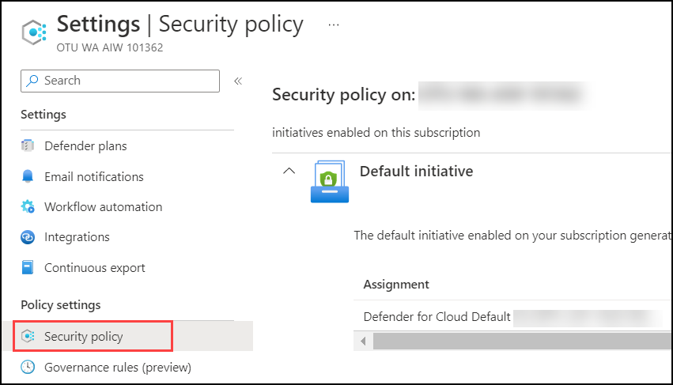
   
1. By default, there is one security policy assignment which is **Defender for Cloud Default**.

    

    > **Note:** This policy is enabled by default on your subscription as per Microsoft Defender for Cloud recommendations. This is the default set of policies monitored by Microsoft Defender for Cloud. It is automatically assigned as part of onboarding to Microsoft Defender for Cloud. The default assignment contains only audit policies. For more information, please visit https://aka.ms/ascpolicies. Also if you see one more policy with ASC default name, please ignore that.

1. To view the policy, click on **Defender for Cloud Default**.

     > **Note:** the assignment name will have GUID of the subscription in your lab environment.

1. On the **Edit Initiative Assignment** page, click on **Parameters** and uncheck the box that is next to **Only show parameters that require input** to view the parameters.

   >Note: This will take a while to load the required parameters.
   
    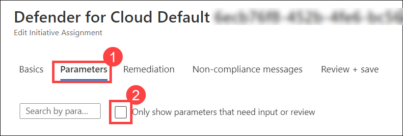
    
1. On the **Edit Initiative Assignment** blade, scroll down and change the action to **AuditIfNotExists** for the parameter **Network Security Groups on the subnet level should be enabled**, to enable monitoring of NSGs on subnets, and click on **Review + save**.

    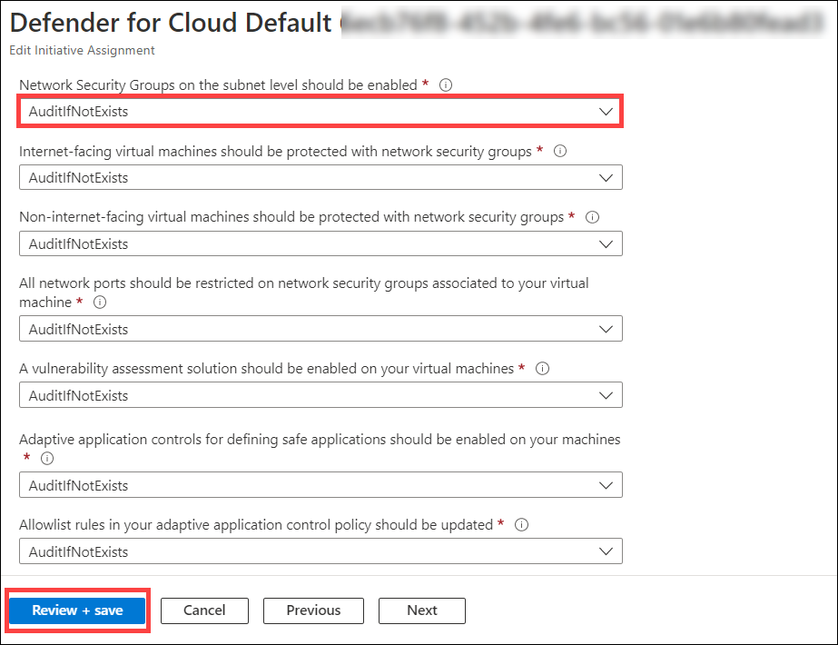

1. On the Review tab, you can see your changes under the Parameters section: **networkSecurityGroupsOnSubnetsMonitoringEffect: AuditIfNotExists** and click on **Save**. Wait for the policy update to complete successfully.

    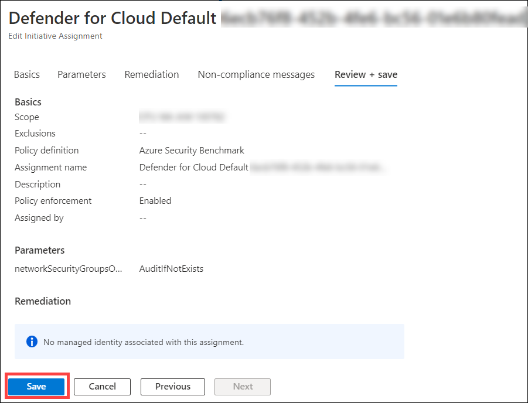


### Exercise 2: Explore Azure Policy

Azure Policy keeps track of compliance for your Azure resources based on policy definitions you assign, these are called policy assignments. By default, Microsoft provides many built-in definitions that you can leverage as you see fit.

1. Type **Policy** in the search box located on the top of the **Azure Portal** page and click on it. Alternately, open a new browser tab in the **labvm-xxxxxx** and navigate to this link ```https://portal.azure.com/#blade/Microsoft_Azure_Policy/PolicyMenuBlade```.

    

2. From the left navigation pane, under the **Authoring** section, click on **Definitions(1)**. This is where you can explore the built-in policy definitions and initiatives.

3. From the top menu use the filter ribbon, set the _Definitions Type_ as **Initiative(2)** and select **Security Center(3)** from the _Category_ filter.

    	

4. You can now see three built-in initiatives used by Microsoft Defender for Cloud:
    -	*Azure Security Benchmark*
    -	*Configure Azure Defender to be enabled on SQL Servers and SQL Managed Instance*
    -	*Configure Advanced Threat Protection to be enabled on open-source relational databases*

    

5. Notice the number of policies included in each initiative (policies column).

6. To see current assignments, click on **Assignments** from the left navigation pane under **Authoring**. Policy initiatives have a different name for the assignments, for example:

    - *Defender for Cloud default*

7. Click on **Defender for Cloud default** to see the assignment details.

   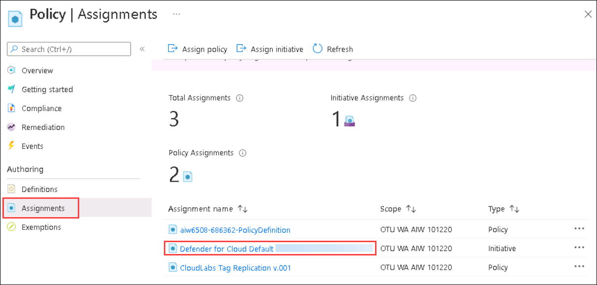 

### Exercise 3: Create resource exemption for a recommendation

Resource exemption will allow increased granularity for you to fine-tune recommendations by providing the ability to exempt certain resources from evaluation.
When working with a recommendation, you can create an exemption by clicking the ellipsis menu on the right side and then select create an exemption.

   > **Note:** Exemptions is a premium Azure policy capability that's offered for Azure Defender customers with no additional cost. For other users, charges may apply in the future.

1. Type **Microsoft Defender for Cloud** in the search box located on the top of the **Azure Portal** page and click on it.

2. Select **Recommendations(1)** from the left navigation pane. Select the **Management ports should be closed on your virtual machines(2)** recommendation under **Secure management porta** section. You can search it using the search box.

    > **Note**: If you don't see the above recommendation that means it is not loaded yet to the control list and it could take up-to 24 hours for all the recommendations to show up. It is possible that during the lab time this may not show up – which is the case sometimes. You can note down this step number then continue to the next exercise and verify this later.

    

3. Expand the **Affected resources** bar, review the current resources under **Unhealthy resources** - **asclab-win**, **labvm-xxxxxx**, and **asclab-linux**.

4. Select the **asclab-win** resource and then click on **Exempt**.

    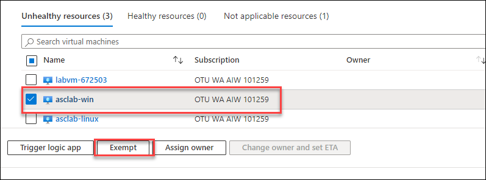

5. The **Exempt pane** opens:
    - Name: **ASC-Management ports should be closed on your virtual machines**.
    - Check the **Set an expiration date** option and set datetime for two days ahead on 12:00 AM.
    - Select **Waiver** as exemption category.
    - Enter **ASC-Management ports should be closed on your virtual machines** for the Exemption description and click on **Create**.

    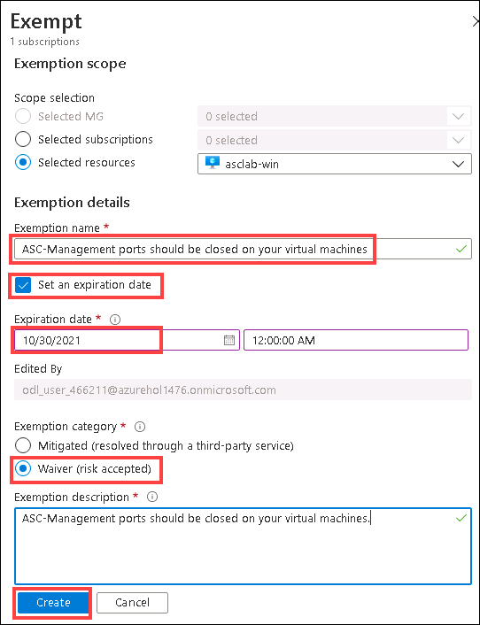

  > ⭐ Good to know: <br>
  > **Mitigated** - This issue isn't relevant to the resource because it's been handled by a different tool or process than the one being suggested
  > **Waiver** - Accepting the risk for this resource

6. It might take up to **30 min for the exemption to take effect**. Once this happens:
    - The resource doesn't impact your secure score.
    - The resource is listed in the Not applicable tab of the recommendation details page
    - The information strip at the top of the recommendation details page lists the number of exempted resources: **1**
    
    <br>

7. Refresh tab and open the **Not applicable resources** tab to review your exempted resource – you can see our resource along with the reason/description value.

    

8.	Exemption rules are based on Azure Policy capability. Therefore, you can track all your exemptions from Azure Policy blade as well.

9. In the search box located on the top of the Azure Portal page, search for **Policy** and click on it. 

    

10. Next, select Exemptions from the left navigation pane. Notice your newly created exemption listed there.

    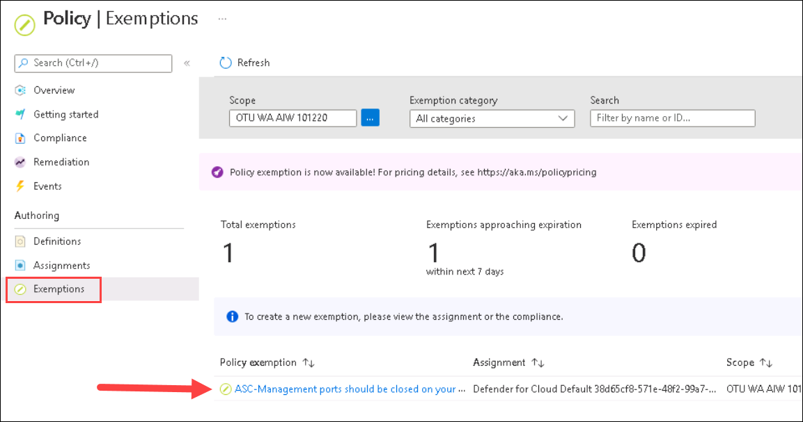

### Exercise 4: Create policy enforcement and deny

In this exercise, you will learn how to use Azure Policy to do some of the more common tasks related to assigning, denying, and managing policies across your organization.

1. In the search box located on the top of the Azure Portal page, search for **Microsoft Defender for Cloud** and click on it.

2. From the left side pane of **Microsoft Defender for Cloud**, select **Recommendations** under **General**.

3. Scroll down to recommendations filters, set the **Response actions** as **Deny**.

    

4. From the filtered recommendations list, select **Secure transfer to storage accounts should be enabled**.

   > Note: If you don't see the above recommendation that means it is not loaded yet and it could take up-to 24 hours for all the recommendations to show up. It is possible that during the lab time this may not show up – which is the case sometimes. You can note down this step number then continue to the next exercise and verify this later.

5. From the top menu bar, click on the **Deny** button. *Enforce and Deny options provide you another way to improve your score by preventing security misconfigurations*.

   > ❗ Important: <br>
   > Security misconfigurations are a major cause of security incidents.

     

6. On the **Deny - Prevent resource creation**, select your subscription (which is currently set to audit mode). This allows you to ensure that from now on, a storage account without the security transfer feature turned on will be denied. Click on **Change to Deny**.

   **Note**: If you unable to edit the query. Click on the eclipse and select **change to Audit** and retry the step

    

7. Go back to the **recommendations view**, set the **Response action** filter as **Select All**. Then type **Auditing** in the search box, . Click on the recommendation **Auditing on SQL server should be enabled**.

   > Note: If you don't see the above recommendation that means it is not loaded yet and it could take up-to 24 hours for all the recommendations to show up. It is possible that during the lab time this may not show up – which is the case sometimes. You can note down this step number then continue to the next exercise and verify this later.

    

8. On the **Auditing on SQL server should be enabled** page, from the top menu bar, click on the **Enforce** button. This option allows you to take advantage of Azure policy’s DeployIfNotExist effect and automatically remediate non-compliant resources upon creation.

9. Once the **Configure SQL servers to have auditing enabled** pane opens with all of the policy configuration options, select the following configuration settings:

* Under the **Basics** tab under the Scope header, select the ellipse icon (...) to select your subscription and click on the **Select**
* Then click on **Next**

    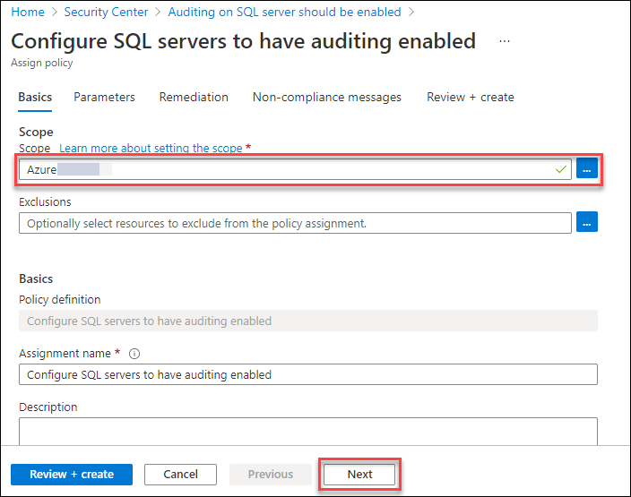

10. In the **Parameters** tab, leave the *Effect* and *Retention days* with default values.

     - **Uncheck** Only show parameters that need input or review
     - Select the resource group **asclab** from the drop down menu
     - Select **Review + create** to assign the policy to your subscription.
     - Click **Create**

      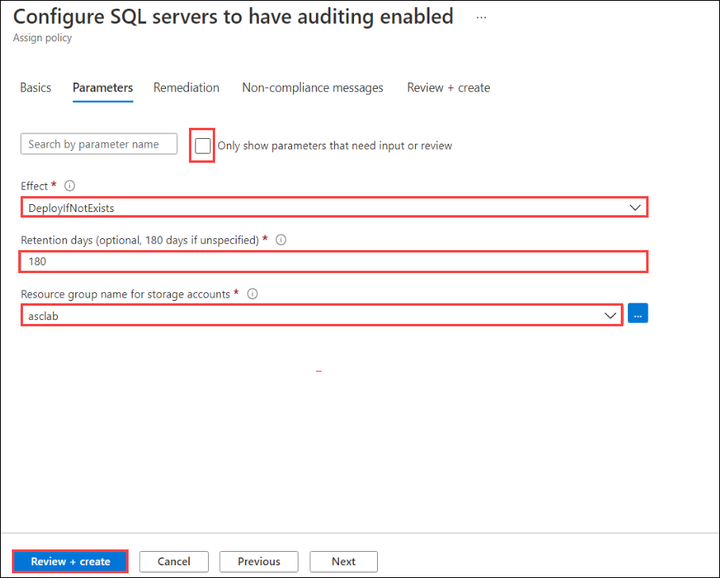

11. On the **Auditing on SQL server should be enabled** page, perform the following steps:

    - Select the **SQL Server resource (1)** found on the **unhealthy resources** tab of **Affected resources** named **<inject key="SQL Server" props="{\&quot;enableCopy\&quot;:true,\&quot;style\&quot;:{\&quot;fontWeight\&quot;:\&quot;bold\&quot;}}" />** 
    - click on **Fix (2)**
    - Select the **asclab-la-XXXXXX (3)** workspace from the dropdown
    - Click **Fix 1 resource (4)**. 
    
By performing above mentioned operations, you can now ensure your existing resources and new ones will be enabled for auditing. Auditing on your SQL Server helps you track database activities across all databases on the server and save them in an audit log.
<br>
      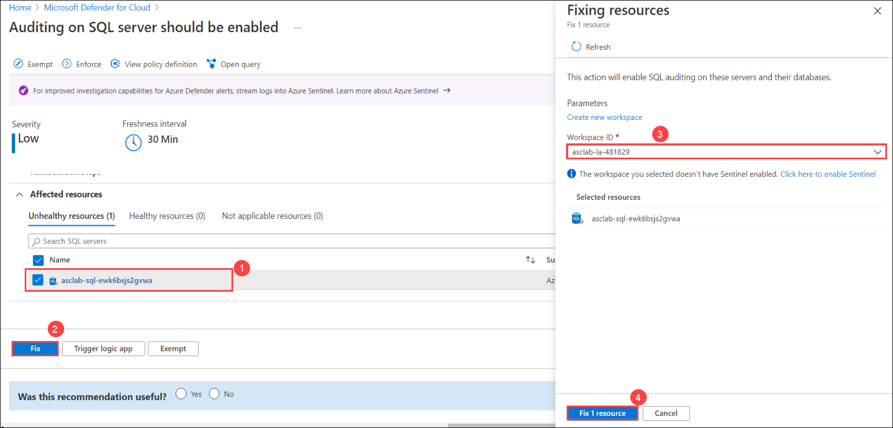

12.	[Click here](https://docs.microsoft.com/en-us/azure/security-center/prevent-misconfigurations#recommendations-with-denyenforce-options "Recommendations with deny/enforce options") to view a full list of recommendations with deny/enforce options along with a detailed explanation of this capability.

13.	[Click here](https://docs.microsoft.com/en-us/azure/security-center/secure-score-security-controls#security-controls-and-their-recommendations "Security controls and their recommendations") to review a list of security controls and their recommendations.


### Exercise 5: Create a custom policy

A custom policy definition allows customers to define their own rules for using Azure. Whatever the business driver for creating a custom policy, the steps are the same for defining the new the custom policy.

***Create a custom initiative using Azure Policy***

1. In the search box located on the top of the Azure Portal page, search for **Policy** and click on it. 

    

2. Select **Definitions(1)** from the left navigation pane.

3. From the top menu, select **+ Initiative definition(2)** to add a new initiative

    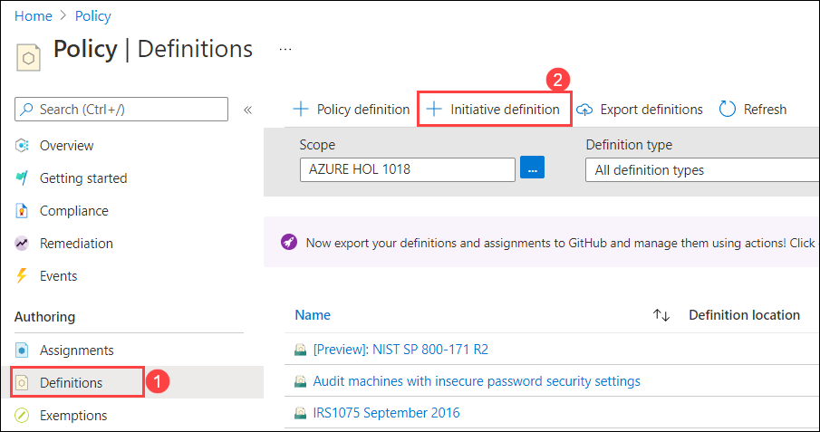

4. On the New Initiative definition page, select the following:
    - Initiative location: Select your Subscription
    - Name: **Contoso Security Benchmark**
    - Description: Baseline for security policies to appear alongside the built-in recommendations
    - Category: Select **Create new** and type: **Contoso**
    - Version: **1**
    - Click **Next**
  
    

5. On the Policies tab, select **Add policy definition(s) (1)**.

6. The Add policy definition(s) pane opens: <br>
Add each policy one by one:
      Search and select the **below policy definitions (2)** and click on **Add (4)**
    - *Managed identity should be used in your Function App*
    - *Public network access on Azure SQL Database should be disabled*
    - *Storage accounts should restrict network access*

7. Select **Review + Create (5)** and click on **Create**.

    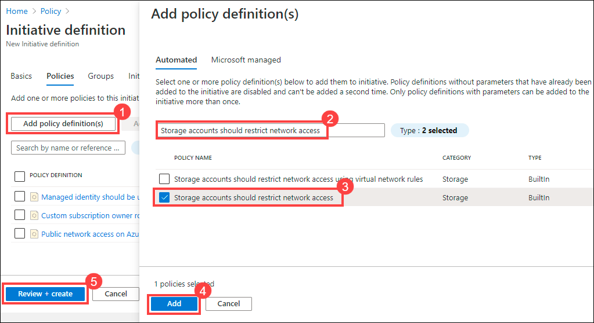

***Add a custom initiative to your subscription***

1. From Azure Portal, search for **Microsoft Defender for Cloud** and select it.

    

2. From **Microsoft Defender for Cloud** blade, Select **Environment settings**. Here you'll be able see the subscription.

    
   
3. In **Environment Settings** page, Select your subscription.

    
   
4. Click on **Security Policy**.

    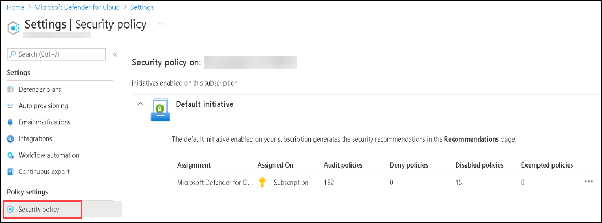

    >**Note:** You must add custom standards at the subscription level (or higher) for them to be evaluated and displayed in Microsoft Defender for Cloud.

5. On the Security policy page, under **Your custom initiatives**, click **Add a custom initiative**.

    

6. Your newly created initiative is listed: **Contoso Security Benchmark**. Select **Add**.

    

7. On the **Assign Initiative** page leave everything as default and select **Review + Create**.
   
    
   
8. Now click on **Create**

    
   
10. Your custom initiative is now assigned.

### Summary

In this module, you have completed Exploring **Microsoft Defender for Cloud** features, **ASC default policy, Azure Policy, Created resource exemption, Created policy enforcement and deny,** and **Created custom policy**.

Now you can move on to the next module by clicking on the Next button at the bottom right of the screen.
