# Module 4 - Regulatory Compliance

### Overview

In this exercise, you will learn about Regulatory Compliance features

You will be performing the following activities to achieve the goal.

* Exploring Regulatory Compliance dashboard
* Adding new standards to Compliance policies
* Creating custom benchmark

### Exercise 1: Understanding Regulatory Compliance dashboard

Microsoft Defender for Cloud helps streamline the process for meeting regulatory compliance requirements, using the regulatory compliance dashboard. The regulatory compliance dashboard shows the status of all the assessments within your environment for your chosen standards and regulations. As you act on the recommendations and reduce risk factors in your environment, your compliance posture improves.

Security Center continuously assesses your hybrid cloud environment to analyze the risk factors according to the controls and best practices in the standards applied to your subscriptions.

1. Navigate to **Microsoft Defender for Cloud** in the Azure portal(perform if not already on the Microsoft Defender for Cloud).

1. On the overview page select the **Regulatory Compliance(1)** tile (this pilar is also available on the left side under the Cloud Security section). Once the **Regulatory Compliance dashboard(2)** opens you can see the compliance standards currently assigned to your subscription.

    

1. On the top strip, notice the number of **Passed vs. failed controls** across standards.

    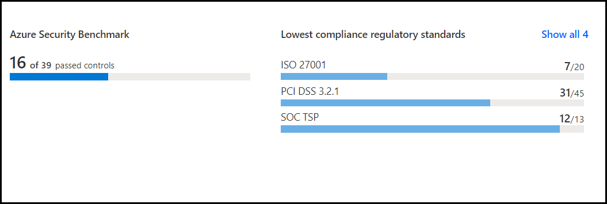

1. On the main page, select **Contoso Security Benchmark** standard. Notice the different compliance controls mapped to assessments.

    

1. Expand the **Contoso Security Benchmark** compliance control. Click on the **Managed identity should be used in your function app**

    
   
1. Under **Managed identity should be used in your function app** tab, expand **Affected resources**.

    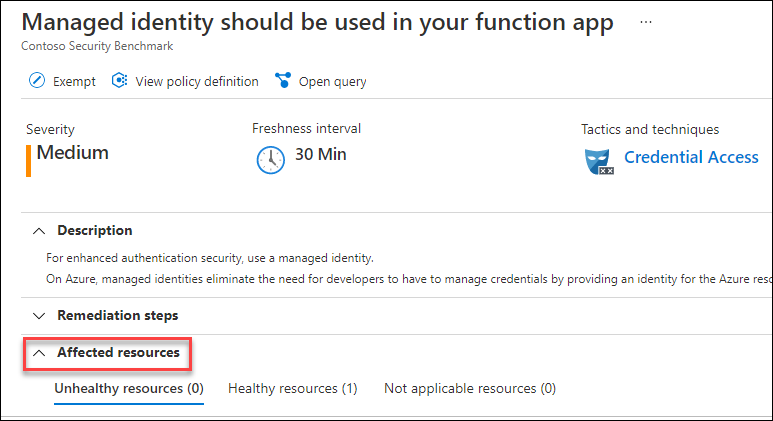
   
1. Now under **Healthy resources (1)**, you can observe the **Function app (2)**.

    

1. Return to the dashboard. Here, you can export the regulatory standard compliance status report as a PDF or CSV file. From the top menu bar, click on **Download report**.

    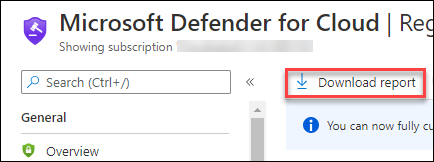

1. On the Report standard dropdown menu, select **PCI DSS 3.2.1 (1)** and format as **PDF (2)**. Click on **Download (3)**.

    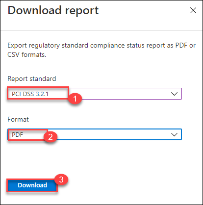

1. A local PDF file is now stored on your machine. Open the **PCI DSS 3.2.1 Compliance Report** and explore it – This report summarizes the status of those assessments on your environment, as mapped to the associated controls.

### Exercise 2: Adding new standards

You can add additional industry standards (represented as compliance packages) such as IST SP 800-53 R4, SWIFT CSP CSCF-v2020, UK Official and more.

1. On **Regulatory Compliance** page, select **Manage compliance policies** from the top menu bar.

    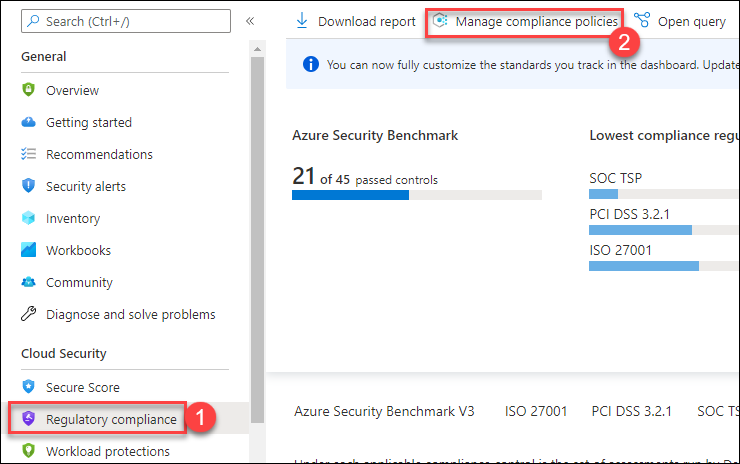

2. Select **Your Subscription** under the Environment settings.

    
   
3. Under **Settings** tab, select **Security Policy (1)**, then expand **Industry & regulatory standards** and click on **Add more standards (2)**.

    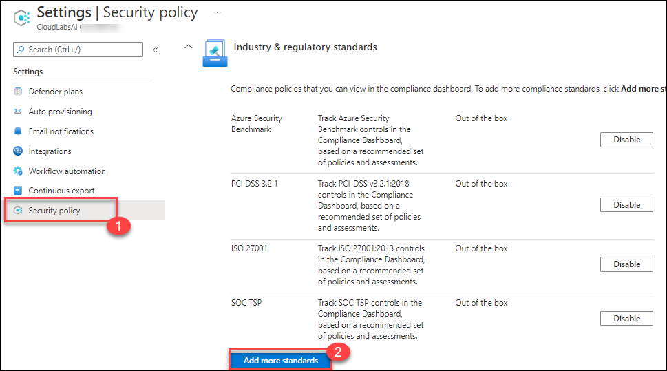
   
4. On the **Add regulatory compliance standards** window, locate the **Azure CIS 1.1.0** standard and click on **Add**.

    

5. Click on **Review + create** and then **Create**.

    

  > ❗ Important:  
  > It will take a while until the change takes an effect (approximately 2-3 hours).

6. **Azure CIS 1.1.0 (New)** should now be listed on the standards list.

     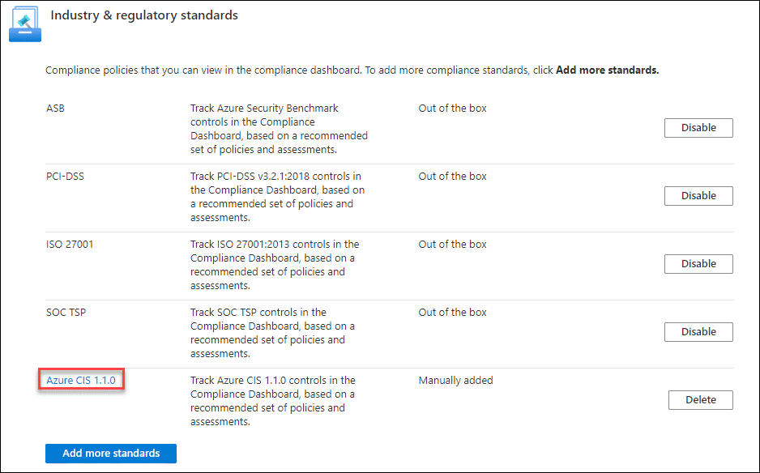

### Exercise 3: Creating your own benchmark

Once you create your custom initiative, Microsoft Defender for Cloud allows you to add it as a security policy and provides two main benefits:
* Security requirements represented as custom recommendations, listed under the recommendation list.
* Track compliance status using regulatory compliance dashboard.

1. In the search box located on the top of the Azure Portal page, search for Policy and click on it.

    

1. From the left pane of the **Policy** page, select **Definitions**.

1. From the top menu, select **+ initiative definition** to create a new policy set definition.

    

1. Under the **Basics** tab, enter the following steps:

   - Initiative location : select your **Subscription (1)**
    
   - Name : Enter **Custom Benchmark (2)**

   - Description: Enter **Custom Benchmark Policy (3)**

   - Category : Click **Use existing (4)** and Select **Security center (5)** from drop-down list.

   - Version : Enter **1 (6)**. Each policy definition and initiative contain a version in its metadata section. You can decide to have major versions (1.0), minor version (1.1) and so.

   - Click on **Next (7)**

    

1. On the **Initiative definition** blade click on **Groups**, in this section you can define your groups and subgroups to be used in your initiative. To add a new group, click on **Create Group**.

    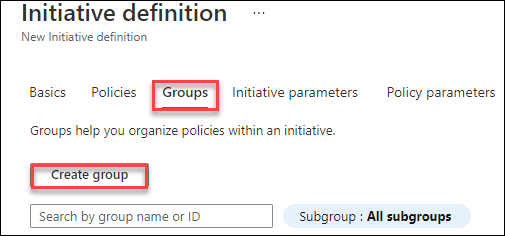
   
1. Under **Create group**, enter the following details:

    - Name : **Group-1 (1)**

    - Subgroup : Click on **Create new (2)** and enter the name as **Sub-group1 (3)**. You can also provide a description. Please note that additional metadata can be used as well. The location of the policyMetadata object that has additional details about the control and compliance domain.
    
    - Click on **Save (4)** to create the new group.  

     
  
1. Repeat the process to create an additional group, for example: **Group 2**.

1. Now you should have two groups to help you organize your policies within the initiative.

1. On the **Initiative definition** blade, click on the **Policies** tab. Here you can add policy definitions, both built-in and custom. Click **Add policy definition(s)**. Select your desired polices, if you create a benchmark, you can also leverage existing policy definitions from **Microsoft managed** tab. For example, you can choose the following policies and select **Add**:
    -	Audit virtual machines without disaster recovery configured
    -	Azure Backup should be enabled for Virtual Machines
    -	Audit VMs that do not use managed disks

     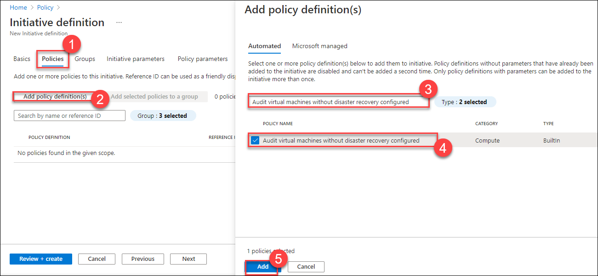

1. Every policy on the list, has its definition name, reference ID and the associated group. However, you do need to define a group for each policy. To do so, click on the **… (1)** to open the context menu and select **Edit groups (2)**.

    

1. Make sure all policies are associated to a group. Please notice that policies can be associated to multiple groups. Here we are selecting **Group 1 (1)** and select **Save (2)**.

     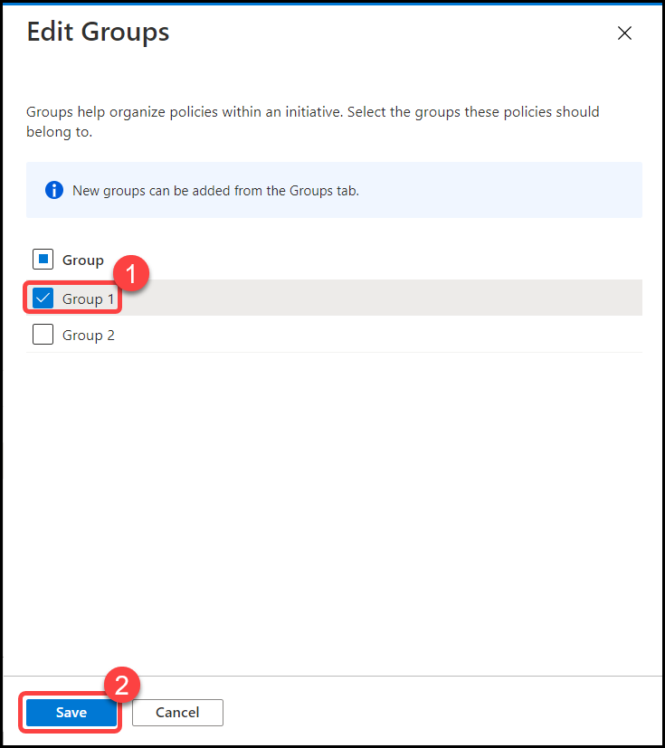

1. You can assign policy and initiative parameters to be used during the assignment process. Skip this section and click on **Review + Create** to validate your settings. Then, click on **Create**

1. You should now see your new initiative listed here – **Custom Benchmark** along with the additional metadata (scope, category, etc.)

    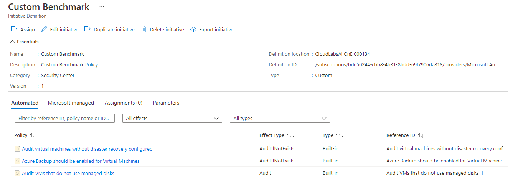

1. To assign your new security policy, type **Microsoft Defender for Cloud** in the search box located on the top of the **Azure Portal** page and click on it.

    
     
1. From **Microsoft Defender for Cloud** blade, Select **Environment settings**. Here you'll be able see the subscription.

    
   
1. In **Environment Settings** page, Select your subscription.

    
    
1. Select **Your Subscription** under the Environment settings.

    
   
1. Under **Settings** tab, select **Security Policy (1)**, then expand **Your custom initiatives** and click on **Add custom initiatives (2)**.

    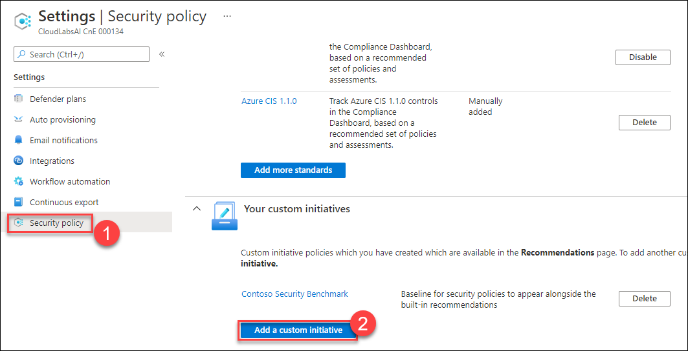

1. On **Add custom initiative** window, your new standard should be listed. Custom Benchmark initiative can be added by clicking on **Add** button. Once assigned, it will be listed in the Recommendations blade and will be added in the **Regulatory Compliance** dashboard too.

    

1. Follow the **on-screen instructions to assign it on the desired scope**. If you decide to include parameters in your initiative here is where you can do it. Click on **Review + create** to start the validation process and then click on **Create**.

1. After some time your new custom benchmark is displayed in Regulatory compliance dashboard along with the built-in regulatory standards.

### Summary

In this module, you have completed Exploring **Security Center** features - **Regulatory Compliance dashboard**, **Added new standards** and **Created your own benchmark**.

Now you can move on to the next module by clicking on the Next button at the bottom right of the screen.
