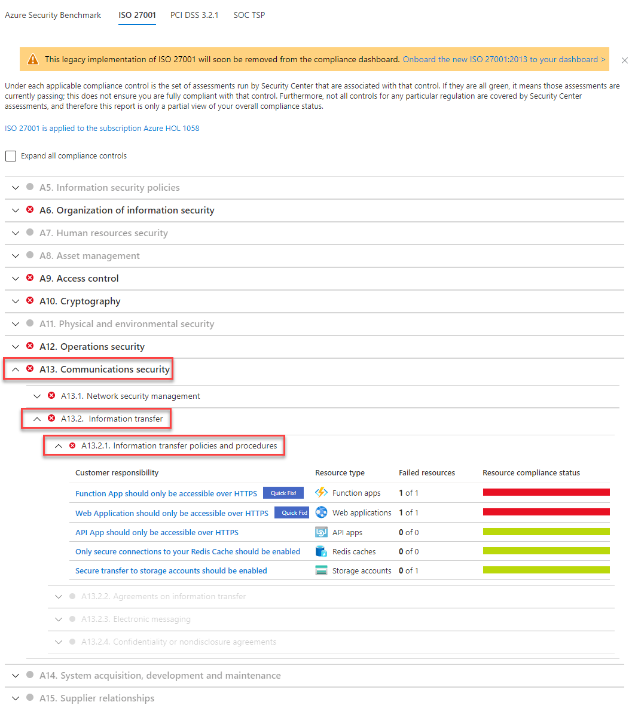
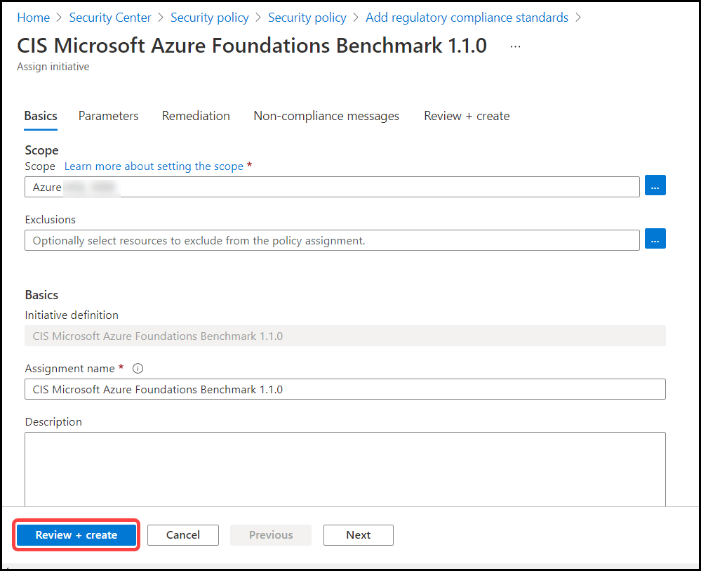
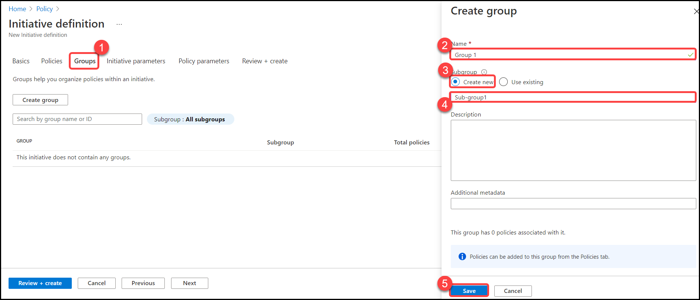
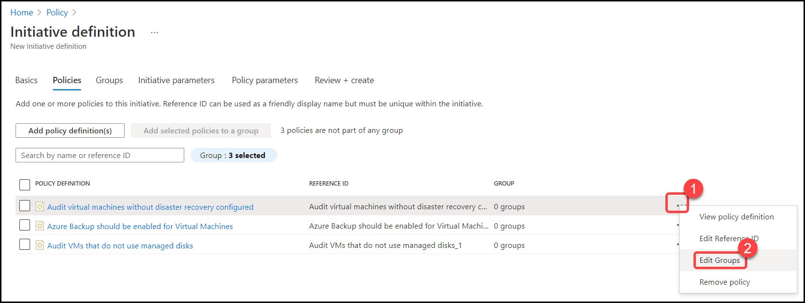

# Module 4 - Regulatory Compliance

### Exercise 1: Understanding Regulatory Compliance dashboard

1.	Click on the Azure Portal icon on the JumpVM and login with the Azure credentials from the Lab Environment Details tab if not logged in already.

2.	From **Security Center main dashboard**, select **Regulatory Compliance** tile (this pilar is also available from the sidebar).

2.	Regulatory Compliance dashboard opens. On this page, you can see the compliance standards currently assigned to your subscription.

3.	On the top strip, notice the number of **passed vs. failed controls** across standards.

4.	On the main page, select **ISO 27001** standard. Notice the different compliance controls mapped to assessments.

5.	Locate the **Communications security** compliance control. Notice the compliance domain **A13.2. Information transfer** and expend to show **A13.2.1. Information transfer policies and procedures** – both are currently *failed*.

6.	From this view you can also remediate assessments. Click the first assessment **Function App should only be accessible over HTTPS**.

7.	On the recommendation *Function App should only be accessible over HTTPS*, select the unhealthy resource (asclab-fa-xxx here xxx is the unique ID) and click **Remediate**. Confirm by selecting **Remediate 1 resource**.

8.	Return to the dashboard. You can export regulatory standard compliance status as a PDF report or CSV file. From the top menu bar, select **Download report**.

9.	On the Report standard dropdown menu, select **PSI DSS 3.2.1** and **PDF**. Click **Download**

10.	A local PDF file is now stored on your machine. Open the **PCI DSS 3.2.1 Compliance Report** and explore the compliance report – This report summarizes the status of those assessments on your environment, as they map to the associated controls.

### Exercise 2: Adding new standards

You can add additional industry standards (represented as compliance packages) such as IST SP 800-53 R4, SWIFT CSP CSCF-v2020, UK Official and more.

1.	From the top menu bar, select **Manage compliance policies**.

2.	Select a scope to assign the new package: **Your Subscription**.

3.	On the **Industry & regulatory standards** section, notice the out of the box standards. Click on **Add more standards**.

4.	On the **Add regulatory compliance standards**, locate the **Azure CIS 1.1.0 (New)** standard and select **Add**.

5.	Click **Review + create** and then **Create**.

> ❗ Important:  
> It will take a while until the change takes an effect (2-3 hours).

6.	**Azure CIS 1.1.0 (New)** should now be listed on the standards list.

### Exercise 3: Creating your own benchmark

Once you create your custom initiative, ASC allows you to add it as security policy and which provides two main benefits:
* Having security requirements represent as custom recommendations under the recommendation list.
* Having a way to track compliance status using regulatory compliance dashboard.

Navigate to Azure Policy blade. You can also select this [link](https://portal.azure.com/#blade/Microsoft_Azure_Policy/PolicyMenuBlade/Overview).

1.	From the left pane, select **Definitions**.

2.	From the top menu, select **+ initiative definition** to create a new policy set definition.

3.	On the Basics tab, select your Subscription.

4.	Select a name, for example: **Custom Benchmark**.

5.	Provide an informative description so others can be clear on what is the purpose of this new security policy.

6.	Select **Category**. You can decide to use existing one (for example: Security Center) or to create your own one. *The recommended approach is to use a custom one so you can quickly filter policy definitions and initiatives when needed (for example: Contoso)*.

7.	Select **Version** number. Each policy definition and initiative contain a version in its metadata section. You can decide to have major versions (1.0), minor version (1.1) and so. See this file for additional instructions. Click **Next**.

8.	Click **Groups**, to define your groups and subgroups to be used in your initiative. To add a new group, click **Create Group**.

9.	Create a new group, for this example we will call **Group 1**, select a subgroup, **Sub-group1** and provide a description. Please aware to the additional metadata which can be used as well. The location of the policyMetadata object that has additional details about the control and compliance domain. Click **Save** to create the new group.

10.	Repeat the previous step to create additional group, for example: Group 2

11.	Now you should have two groups to help you organize your policies within the initiative.

12.	Click on the **Policies** tab. Here you can add policy definitions, both built-in and custom. Click Add policy definition(s). Select your desired polices, if you create a benchmark, you can also leverage existing policy definitions from **Microsoft managed** tab. For example, you can choose the following policies and select Add:
    -	Audit virtual machines without disaster recovery configured
    -	Azure Backup should be enabled for Virtual Machines
    -	Audit VMs that do not use managed disks

13.	Each policy on the list, has its definition name, reference ID and the associated group. However, you do need to define a group for each policy. To do so, click on the **…** to open the context menu and select **Edit groups**.

14.	Make sure all policies are associated to a group. Please notice that policies can be associated to multiple groups.

15.	You can assign policy and initiative parameters to be used during the assignment process. Skip this section and click on Review + Create to validate your settings. Then, click on Create.
16.	You should now see your new initiative listed – **Custom Benchmark** along with the additional metadata (scope, category, etc.)

17.	To assign your new security policy, open **Security Center blade**.

18.	From the left navigation pane, under Management section, click on **Security policy**.

19.	Select a **Subscription** to assign your new security policy.

20.	On **Security policy** page, hover to Your custom initiatives and select **Add a custom initiative**. 

21.	On **Add custom initiative**, your new standard should be listed there, so you can click on **Add** to assign to it. Once assigned, it will be listed as a recommendation in the Recommendations blade and be added in the Regulatory Compliance dashboard.

22.	Follow the **on-screen instructions to assign it on the desired scope**. If you decided to include parameters in your initiative, now you should be able to fulfill them. Click **Review + create** to start the validation process and then **Create**.

23.	Now your new security benchmark is displayed in regulatory compliance along with the built-in regulatory standards.

### Summary

In this module, you have completed Exploring **Security Center** features - **Regulatory Compliance dashboard**, **Adding new standards** and **Creating your own benchmark**.

Now you can move on to the next module by clicking on the Next button at the bottom right of the screen.
