# Module 5 - Improving your Secure Posture


## Overview

This module will walk you through the process to use the vulnerability assessment for Virtual Machines and Containers, along with the usage of Workflow Automation and data query.

### Exercise 1: Vulnerability assessment for VMs

With Azure Defender for servers, you can quickly deploy the integrated vulnerability assessment solution (powered by Qualys) with no additional configuration or extra costs. Once the vulnerability assessment scanner is deployed, it continually assesses all the installed applications on a virtual machine to find vulnerabilities and presents its findings in the Azure Security Center console. When a machine is found that doesn't have a vulnerability assessment solution deployed, Azure Security Center generates a recommendation that looks like this: _A vulnerability assessment solution should be enabled on your virtual machines._ To remediate a resource, you can click on the **Quick Fix** button to deploy the necessary VM extension.

**Explore vulnerability assessment recommendations:**

1.	On **Security Center** page, click on **Security policy** present under the **Management** section.

2.	Click on **Recommendations (1)** from the left side pane.

3.	Expand **Remediate vulnerabilities (2)** security control (which contains all recommendations related to security vulnerabilities).

4.	Make sure you have **A vulnerability assessment solution should be enabled on your virtual machines (3)** recommendation listed here. If you don’t, you will need **24 hours** to have the recommendation with the assessment.

   

5.	Click on **A vulnerability assessment solution should be enabled on your virtual machines** recommendation and open it.

6.	Click to expand **Remediation steps (1)** – then click on the **Quick fix logic (2)** option to expose an automatic remediation script content (ARM template). Once done, **Close (3)** this window.

   

7.	From the **unhealthy resources (1)** tab, select both **asclab-win** and **aslab-linux** **(2)** virtual machines. Click on  **Fix (3)**.

   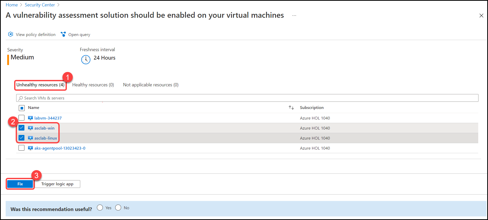

8.	On the **Choose a vulnerability assessment solution** select **Recommended: Deploy ASC integrated vulnerability scanner powered by Qualys (included in Azure Defender for servers) (1)**. Click on  **Proceed (2)**.

   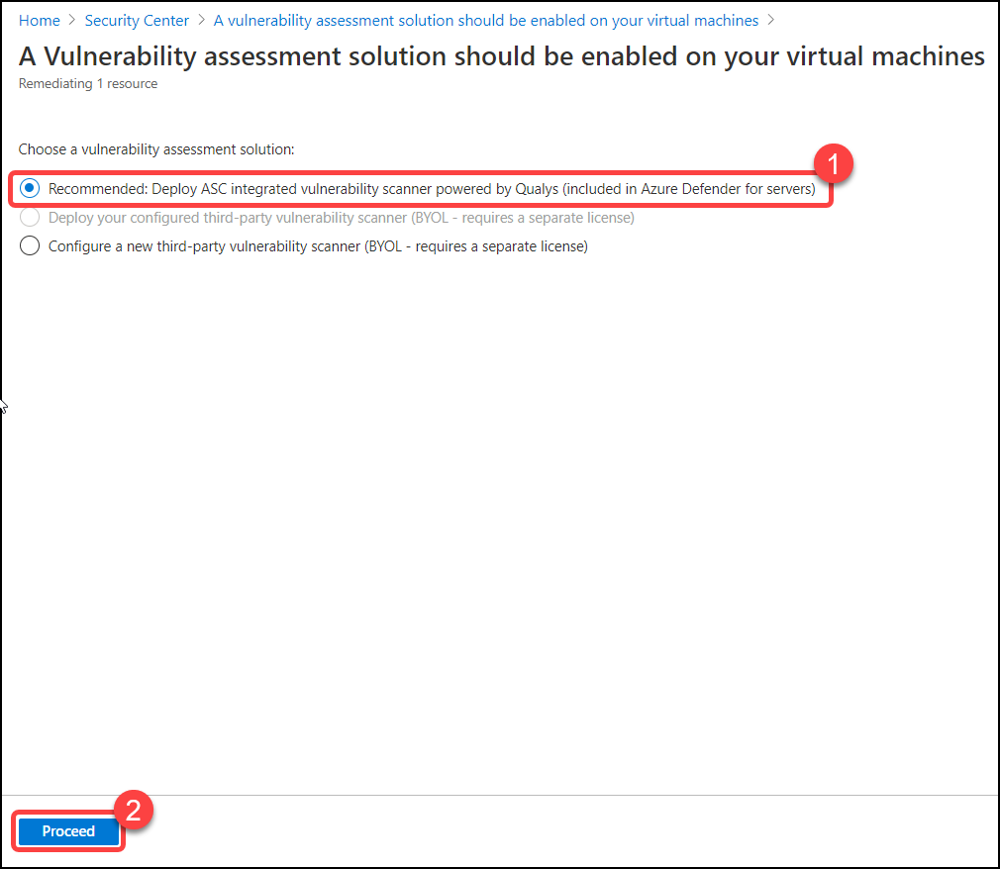

9.	A window of **Fixing resources** will open, on this page review the list of VMs and click on **Fix 2 resources** 

10. Remediation is now in process. Azure Security Center will deploy the Qualys VM extension on the selected VMs, so you track the status using the notification area or by using Azure activity log. **Wait for 5-10 minutes for the process to complete**.

> **Note:** You can find a list of supported operating systems [here](https://docs.microsoft.com/en-us/azure/security-center/deploy-vulnerability-assessment-vm#deploy-the-integrated-scanner-to-your-azure-and-hybrid-machines).

11. Ensure the VM extension is deployed on the relevant machines:
    - Search for **Virtual Machines** in the search box located on the top of the **Azure Portal** page and click on it.
    - Select **asclab-win(1)**. next, click on **Extensions(2)** under the **Settings** section.
    - Ensure that `WindowsAgent.AzureSecurityCenter` extension is installed and the status is **Provisioning succeeded**.
  
   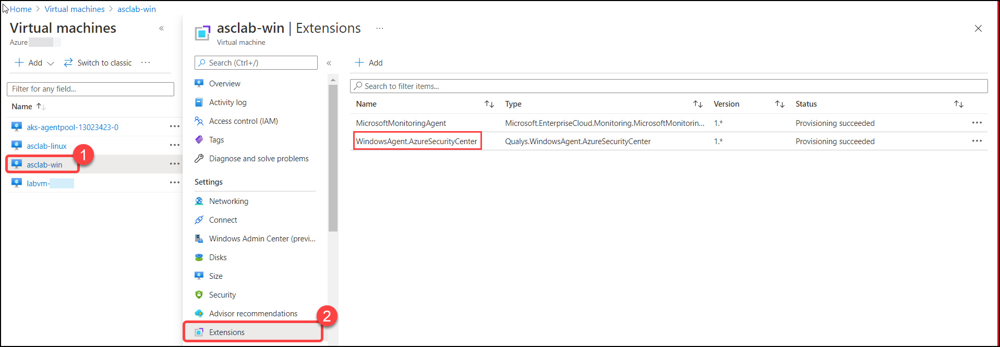

12. Repeat the above step (step10) for **asclab-linux** – you should expect to see a different name for the extension on the Linux platform: `LinuxAgent.AzureSecurityCenter`.

   

> **Note:** There are multiple ways you can automate the process where you need to achieve at scale deployment. More details are available on our [documentation](https://docs.microsoft.com/en-us/azure/security-center/deploy-vulnerability-assessment-vm#automate-at-scale-deployments) and on [blog](https://techcommunity.microsoft.com/t5/azure-security-center/built-in-vulnerability-assessment-for-vms-in-azure-security/ba-p/1577947).

13. The VA agent will now collect all required artifacts, send them to Qualys Cloud and findings will be presented back on the ASC console within 24 hours.

### Exercise 2: Vulnerability assessment for Containers

Azure Security Center scans images in your Azure Container Registry (ACR) that are pushed and imported into the registry, it also contains any other images pulled within the last 30 days. Then, it exposes detailed findings per image. All vulnerabilities can be found in the following recommendation: **Vulnerabilities in Azure Container Registry images should be remediated (powered by Qualys).**

To simulate a container registry image with vulnerabilities, we will use ACR tasks commands and sample image:

1. Search for **Container registries** in the search box located on the top of the **Azure Portal** page and click on it, or click [here](https://portal.azure.com/#blade/HubsExtension/BrowseResource/resourceType/Microsoft.ContainerRegistry%2Fregistries).

2. Copy the name or your container registry, for example: *asclabcrktfvrxcne4kki*

   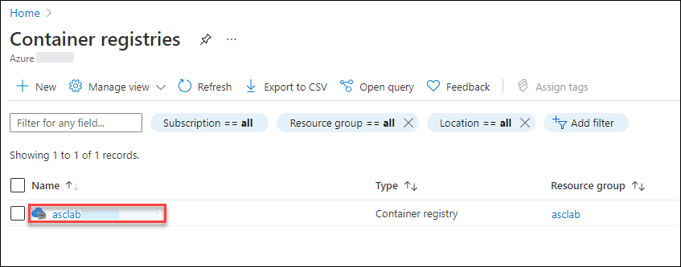

3. In the Azure portal, open the **Cloud Shell** pane by selecting the toolbar icon directly to the right of the search textbox or click on [Azure Cloud Shell](https://shell.azure.com/).

   

4. If prompted to select either Bash or PowerShell, select **Bash**.

    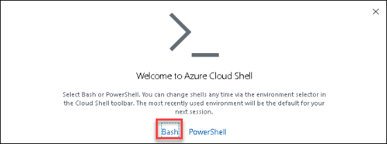

5. When prompted, click **Create storage**, and wait for the Azure Cloud Shell to initialize. 

6.	Build a Linux container image from the hello-world image hosted at Microsoft Container Registry and push it to the existing Azure Container Registry instance on your subscription:

Run the following two script blocks:

   ```
   echo FROM mcr.microsoft.com/azuredocs/aci-helloworld > Dockerfile
   ```

Modify the following script to include your container registry name in the placeholder <your container registry name>

   ```
   az acr build --image sample/hello-world:v1 --registry <your container registry name> --file Dockerfile .
   ```


7. Wait for a successful execution message to appear. For example: Run ID: cb1 was successful after 23s.

8. The scan completes typically within few minutes, but it might take up to 15 minutes for the vulnerabilities/security findings to appear on the Recommendations page.

9.	Search for **Security Center** in the search box located on the top of the **Azure Portal** page and click on it.

10. Click on **Recommendations (1)** from the left side pane under the **General** section. Expand **Remediate vulnerabilities** security control and select **Vulnerabilities in Azure Container Registry images should be remediated (powered by Qualys) (2)**.

    

11. On the recommendation page, notice the following details at the upper section:

    - Unhealthy registries: **1/1**
    - Severity: **High**
    - Total vulnerabilities: **expect to see more than 2 vulnerabilities**

   

12. Expand the **Affected resources** section and notice the **Unhealthy registries** count which shows **1 container registry** (asclab**xxx** here xxx is unique ID).

    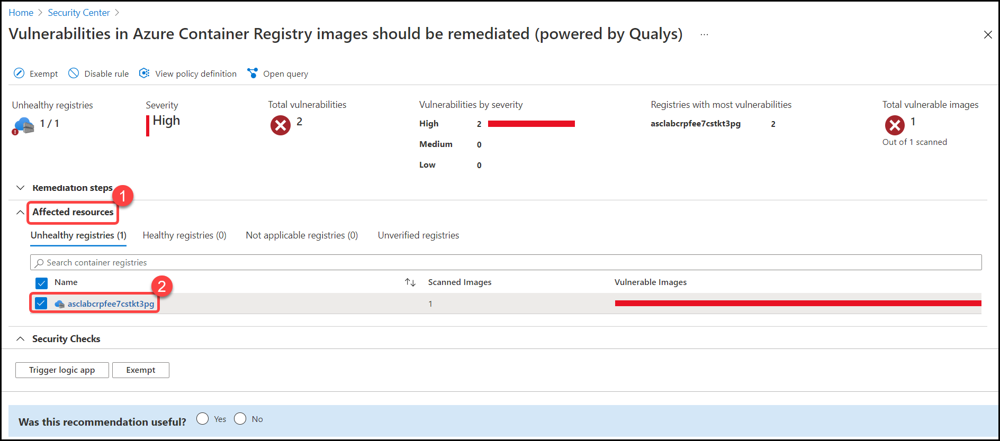

13. On the **Security Checks** section, notice the number of vulnerabilities.

14. Click on the first security check to open the **XXXXXX- User(s) with Blank Password** pane.

    >XXXXXX is the ID of the security finding.

    

Notice the vulnerability description, general information (containing the Cvss 2.0 base score, etc.), remediation steps/workaround, additional information, and the affected (vulnerable) image. **Close this window.**

### Exercise 3: Automate recommendations with workflow automation

Every security program includes multiple workflows for incident response. The process might include notifying relevant stakeholders, launching a change management process, and applying specific remediation steps. With the help of workflow automation, you can trigger logic apps to automate processes in real-time with Security Center events (security alerts or recommendations). In this lab, you will create a new Logic App and then trigger it automatically using the workflow automation feature when there is a change with a specific recommendation.

**Create a new Logic App:**

1.	Search for **Logic Apps** in the search box located on the top of the **Azure Portal** page and click on it, or [click here](https://ms.portal.azure.com/#blade/HubsExtension/BrowseResource/resourceType/Microsoft.Logic%2Fworkflows).

2.	Click on **+Add** and select **Consumption** to create a new Logic App.

3.	On the Basics tab, select your subscription and resource group **asclab**.

4.	On the Logic app name field enter **Send-RecommendationsChanges**.

5.	Select location, for example: **East US** (it’s recommended to use the same region as used in the previous exercises).

6.	Ensure the **Enable log analytics** option is unchecked.

7.	Select **Review + Create** and then click on **Create**.

   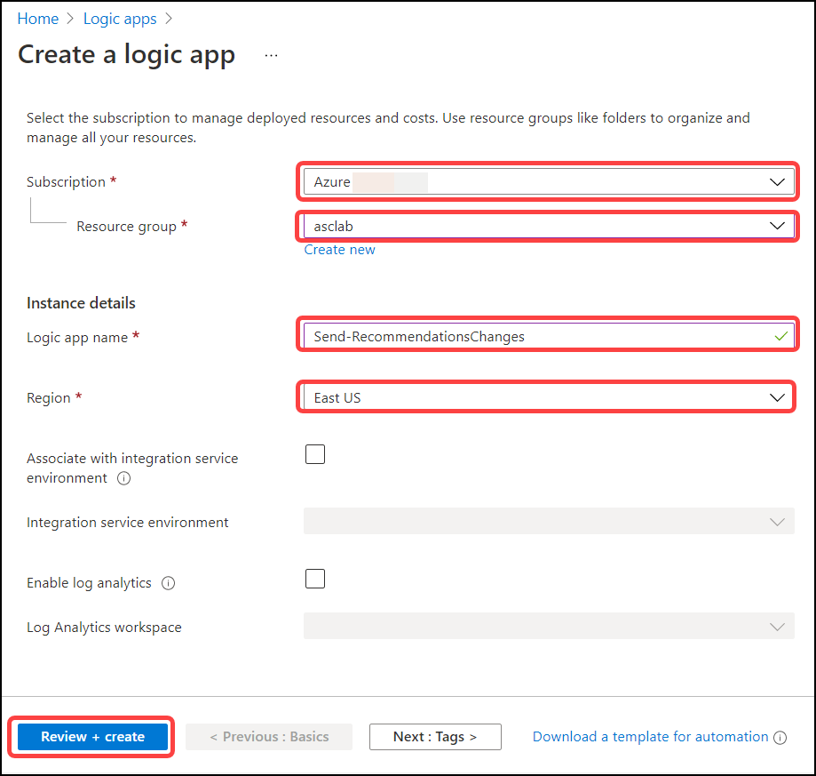

8.	When the **Deployment** is completed click on **Go to resource**

   

9.	After the Logic Apps Designer opens, select **Blank Logic App**.

   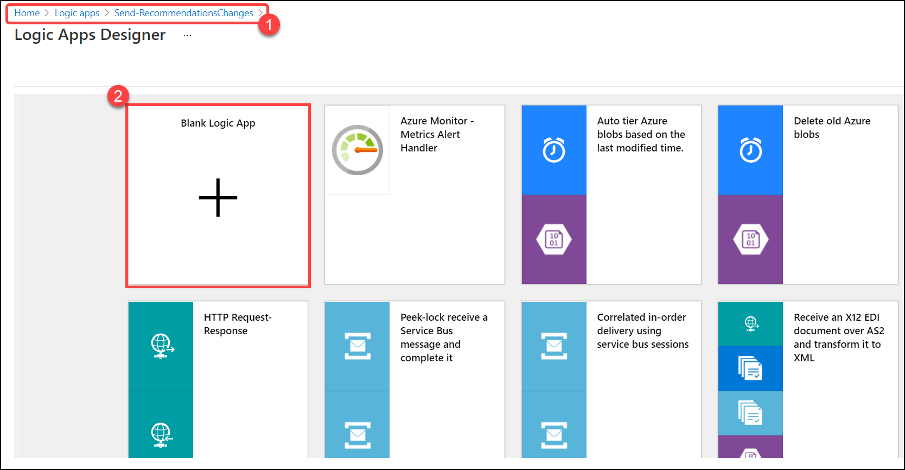

10. Search for **Security Center** in the search box and select **When an Azure Security Center Recommendation is created or triggered** from the list of **Triggers**

    

11. Click on the **new step** button and type **Outlook send**.

    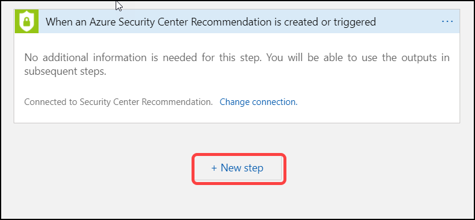

12. From the list of actions, select **Send an email (V2)** action to add it to the Designer.

> **Note:** You will need to sign into your Outlook.com (Use Odl user from Environment details) and grant permissions for the Logic App to send email using your account.

13. In the Send an email (V2), add the email address used for performing the lab in the **To** field.

> Later, you will use the same email address to check if you have received an email using workflow automation feature.

14. Click in the **Subject box**, then type: **Recommendation changed:**

15. Click just after Recommendation changed: to get your cursor in the right place. In the dynamic content box, click on the **Dynamic content** tab and then select `Properties Display Name` in the list (click Add dynamic content if it doesn’t pop out automatically).

16. Click into the Body text box and type the following:

    - **The following recommendation has been changed**</br>
    - **Recommendation:**</br>
    - **Description:**</br>
    - **Status:**</br>
    - **Link to recommendation:**</br>

17. Click just after each section, to get your cursor in the right place. In the **dynamic content box**, match each line to the following content by selecting in the list:

   - Recommendation: `Properties Display Name`</br>
   - Description: `Properties Metadata Description`</br>
   - Status: `Properties Status Code`</br>
   - Link to recommendation: `Properties Links Azure Portal Uri`</br>

18. Verify that Your Logic App looks like the below screenshot and then click on **Save** in the Logic App Designer.

   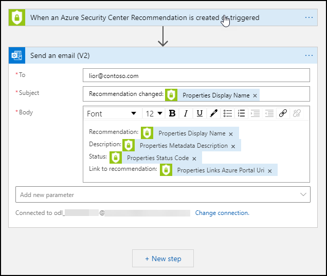

**Create a new workflow automation instance**

1.	Search for **Security Center** in the search box located on the top of the **Azure Portal** page and click on it.

2.	Select **Workflow automation (1)** under **Management** section from the left side pane, and click on **Add workflow automation (2)**.

3.	A pane appears on the right side. Enter the following for each field:
    
   - General:
   
     * Name: **Send-RecommendationsChanges**
     * Description: **Send email message when a recommendation is created or triggered**
     * Subscription: **Your Subscription**
     * Resource group: **asclab**
      
   - Trigger conditions:
   
     * Select Security Center data types: **Security Center recommendations**
     * Recommendations name: **All recommendations selected**
     * Recommendation severity: **All severities selected**
     * Recommendation state: **All states selected**
    
   - Actions:
   
     * Show Logic App instances from the following subscriptions: **Your Subscription**
     * Logic App name: **Send-RecommendationsChanges**
     
   Click **Create** to complete the task.

   

4.	Wait for the message **"Workflow automation created successfully. Changes may take up to 5 minutes to be reflected"** to appear. From now on, you will get email notifications for recommendations.

Once you start to get email notifications, you can disable the automation by selecting the workflow and clicking on **Disable**.

> Please be aware that if your trigger is a recommendation that has "sub-recommendations” / “nested recommendations”, the logic app will not trigger for every new security finding when the status of the parent has changed.

5. Once the automation is automatically triggered, you should expect the email message to look like the screenshot below:

   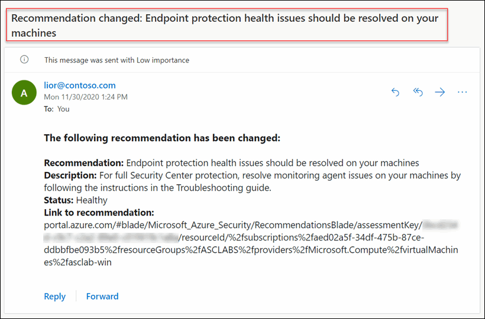

6.	Test/trigger your automation manually:
    - On the Security Center pane, click on **Recommendations (1)** from the **General** section.
    
    - Under **Remediate vulnerabilities (2)** look for recommendation **Azure Defender for SQL should be enabled on your SQL servers (3)** and click on it.

   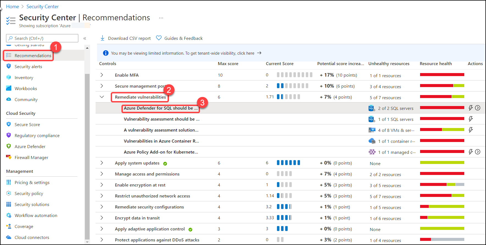

    - Select resource **asclab-sql-xxx** (here xxx is unique ID) and then click on the **Trigger Logic App** button.
    - In the Trigger a logic app blade, select the Logic App you created in the previous step (Send-RecommendationsChanges) then click on **Trigger**.
    - You should receive an email, verify in your inbox. On the labvm-xxxxxx open a new tab in web browser and navigate to https://outlook.office365.com.


   

### Exercise 4: Accessing your secure score via ARG
Azure Resource Graph (ARG) provides an efficient and performant resource exploration with the ability to query at scale across a given set of subscriptions.
Azure Secure Score data is available in ARG so you can query and calculate your score for the security controls and accurately calculate the aggregated score across multiple subscriptions.

1.	Search for **arg** in the search box located on the top of the **Azure Portal** page and click on **Resource Graph Explorer**.


2.	Paste the following KQL query and then select **Run query**.

   ```
   SecurityResources
   | where type == 'microsoft.security/securescores'
   | extend current = properties.score.current, max = todouble(properties.score.max)
   | project subscriptionId, current, max, percentage = ((current / max)*100)
   ```

   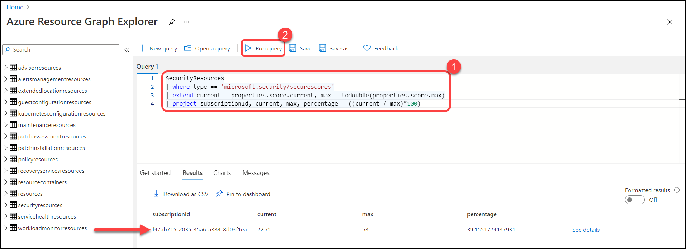

3.	You should now see your subscription ID listed here along with the current score (in points), the max score and the score in percentage.

4.	To return the status of all the security controls, select **New query**. Next, paste the following KQL query and click on **Run query**:

   ```
   SecurityResources
   | where type == 'microsoft.security/securescores/securescorecontrols'
   | extend SecureControl = properties.displayName, unhealthy = properties.unhealthyResourceCount, currentscore = properties.score.current, maxscore = properties.score.max
   | project SecureControl , unhealthy, currentscore, maxscore
   ```

   

More details on the [official article](https://docs.microsoft.com/en-us/azure/security-center/secure-score-security-controls) or on the [blog post](https://techcommunity.microsoft.com/t5/azure-security-center/querying-your-secure-score-across-multiple-subscriptions-in/ba-p/1749193)


### Summary

  * In this module, you have completed exploring more **Security Center** features - **Vulnerability assessment for VMs**, **Vulnerability assessment for Containers**, **Automated recommendations with workflow automation** and **Accessed your secure score via ARG**.

Now you can move on to the next module by clicking on the Next button at the bottom right of the screen.
