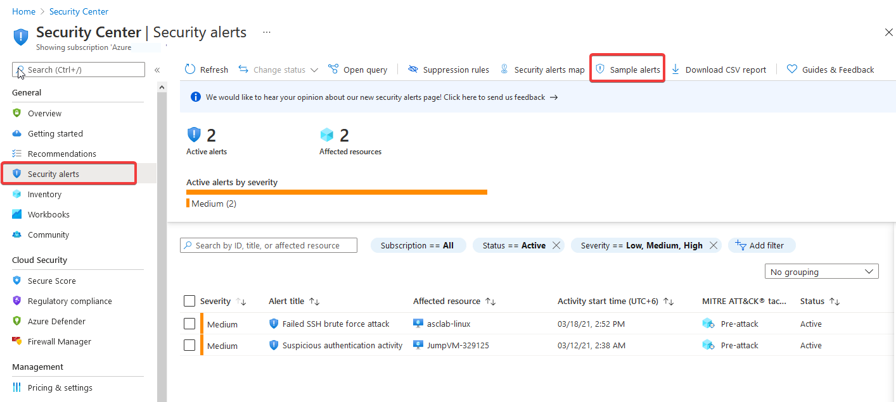
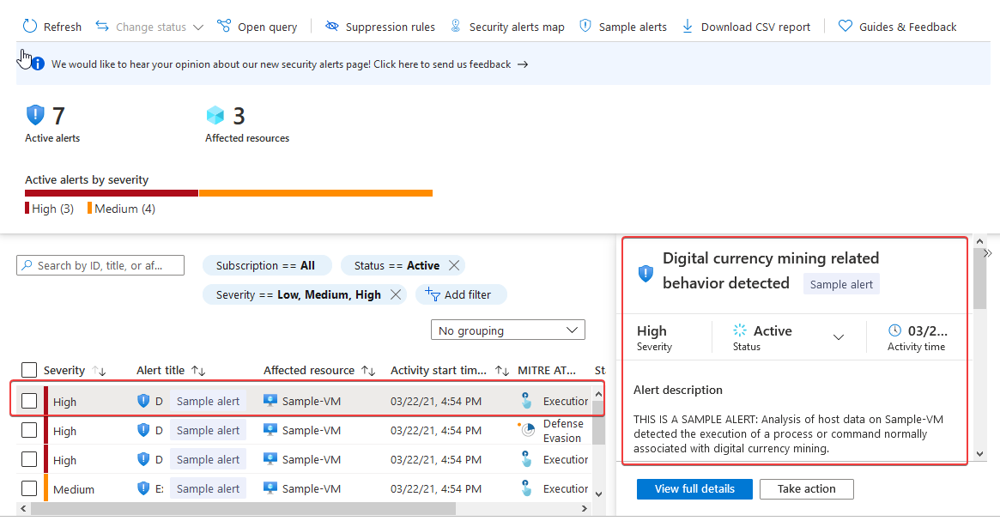
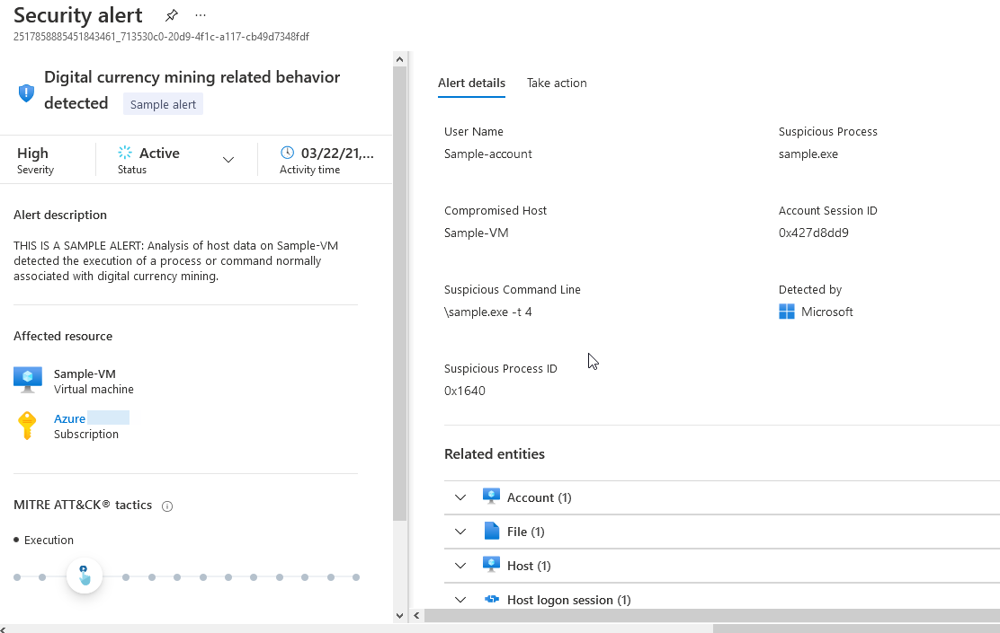
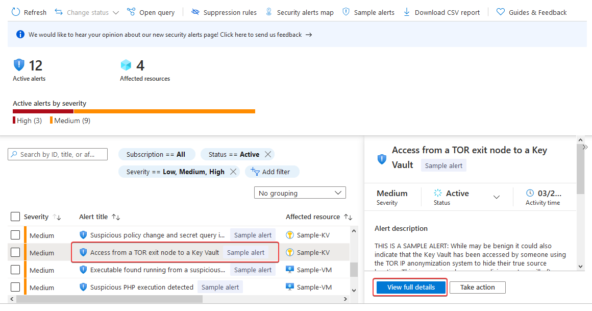
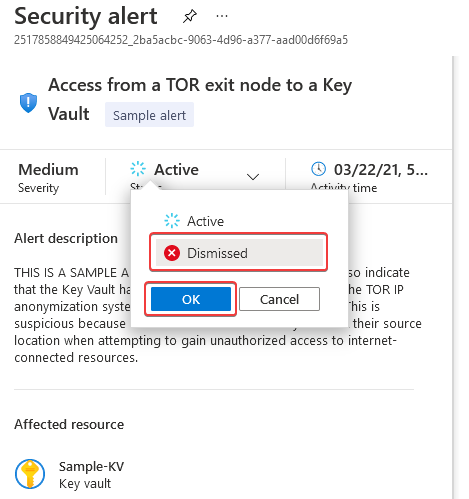
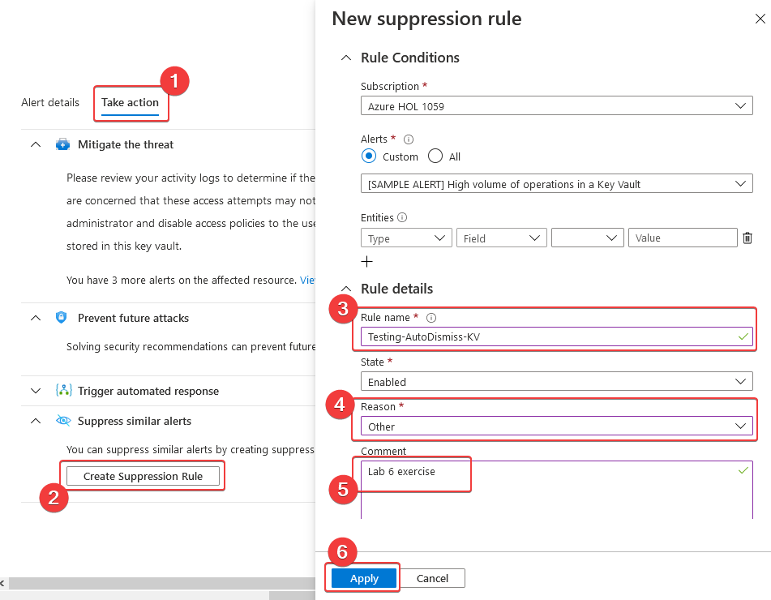
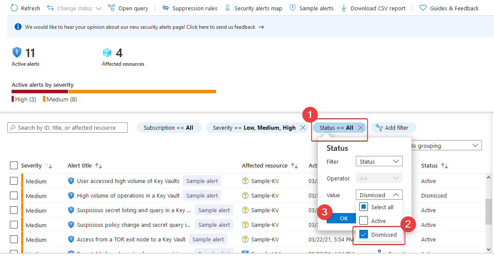
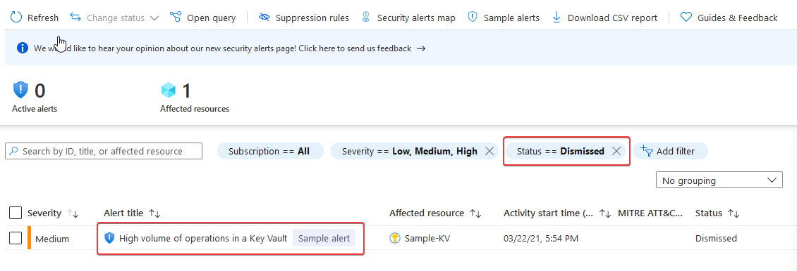
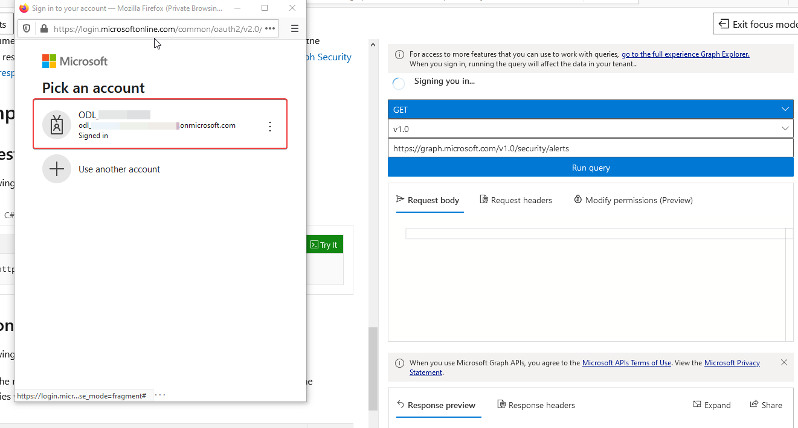
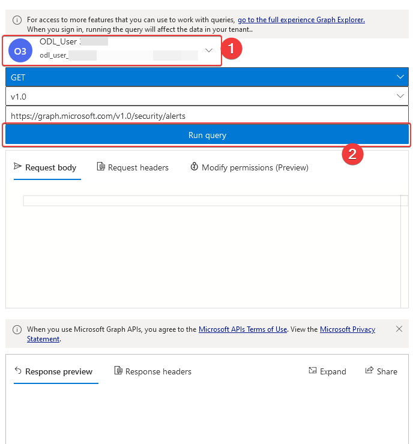

# Module 6 - Azure Defender

### Exercise 1: Alert validation

Here let’s cover the new Alert Simulation, which should be out in the first week of December

1.	Click on the Azure Portal icon on the JumpVM and login with the Azure credentials from the Lab Environment output page.

2.	Open the preview page of security alerts by using this [link](https://portal.azure.com/?feature.argsecurityalerts=true&feature.customportal=false#blade/Microsoft_Azure_Security/SecurityMenuBlade/7)

2.	Create an alert simulation for VM:
    - On Security alerts page, click on **Sample alerts** button.
    
    
    
    - Select **Azure subscription 1**.
    - On the Azure Defender plans, keep only **Virtual Machines** selected.
    - Click on the **Create sample alerts** button to trigger the alert simulation for VMs.

3.	Sample alerts creation in progress, wait for the process to complete. You can track the progress by opening the notification center or on activity log (this process usually takes 2 minutes to complete)

4.	On the alerts page, you should now see 5 different sample events for a resource named `Sample-VM`. Each alert has the Sample alert banner next to it.

5.	Click on the **Digital currency mining related behavior detected alert**.

6.	The details pane opens. Notice the alert properties at the top (severity, status, and time) along with the alerts description and affected resources. At the bottom part, you can see the kill chain intent of the alert based on the MITRE ATT&CK® framework. This specific alert is at the *Execution* phase.

7.	To explore the full details of the alert, click on **View full details**.

8.	Create an alert simulation for Key Vaults:
    - On Security alerts page, click on **sample alerts** button.
    - Select **Azure subscription 1**.
    - On the Azure Defender plans, keep only **Key Vaults** selected.
    - Click **Create sample alerts** button to trigger the alert simulation for Key Vaults.
9.	Sample alerts creating in progress, wait for the process to complete. You can track the progress by opening the notification center or on activity log (this process usually takes 2 minutes to complete)

10.	On the alerts page, you should now see 5 different sample events for a resource named `Sample-KV`. Each alert has the `Sample alert` banner next to it.

11.	Click on the **Access from a TOR exit node to a Key Vault** alert.

12.	Click on the **View full details** to see additional information related to the event.

13.	At the top menu, dismiss the alert by changing the status from Active to **Dismiss**.

> Note: You can choose to trigger sample alerts for additional Azure Defender plans.

### Exercise 2: Alert suppression

When a single alert isn't interesting or relevant, you can manually dismiss it.
In the previous step, we used the dismiss option to manually dismiss a single alert. However, you can use the suppression rules feature to automatically dismiss similar alerts in the future.

1.	From Security Center sidebar, select **Security alerts**.

2.	Select **High volume of operations in a Key Vault** alert and then click on **Take action**.

3.	Expend the Suppress similar alerts section and click on **Create Suppression Rule**.

4.	The new suppression rule pane opens, provide a rule name: *Testing-AutoDismiss-KV*.

5.	On the reason field, select Other and leave a comment: *Lab 6 exercise*.

6.	Set rule expiration to be tomorrow (just a day ahead). **Click Apply and wait 10 minutes for the new rule to be applied.**

7.	Validate your alert suppression rule:
    - From the top menu, click on the **Create sample alerts** button.
    - Select the **Key vaults** plan only.
    - Click **Create sample alerts**.
    - You should now see only **4** Key Vaults alerts **excluding the High volume of operations in a Key Vault**.

> Note, you can create suppression rules on a management group level by using a built-in policy definition named Deploy - Configure suppression rules for Azure Security Center alerts in Azure Policy. To suppress alerts at the subscription level, you can use the Azure portal or REST APIs.

8. You can change your existing suppression rules or create new ones: from the top menu, select **Suppression rules**. 

9. Click on the rule you have recently created: `Testing-AutoDismiss-KV`.

10. Change the expiration to be a month ahead from the current date. Click **Apply**.

11. View dismissed alerts: On the Security alerts main page, on the filters section, change the Status filter to show only **Dismissed** items.

12. You should now expect to see only **1 dismissed alert**: High volume of operations in a Key Vault Sample alert.

### Exercise 3: Accessing Security Alerts using Graph Security API

You can also query security alerts data using REST APIs such as the Microsoft Graph Security API which provides a unified interface and schema to integrate with security solutions from Microsoft and Partners.

In this exercise, we will use one of the endpoints which allows to retrieve a list of alert objects.

1.	Navigate to [List alerts](https://docs.microsoft.com/en-us/graph/api/alert-list?view=graph-rest-1.0) page.

2.	Scroll down to the **Example** section for a request or [click here](https://docs.microsoft.com/en-us/graph/api/alert-list?view=graph-rest-1.0&tabs=http#example).

3.	On the HTTP tab, review the endpoint URL: `https://graph.microsoft.com/v1.0/security/alerts`.

4.	You need to login using credentials given in the Environment Details.

5.	On the right side, click on **Try it** to load the graph explorer with the required endpoint.

6.	Click on **Run query** button.

7.	You should now see a sample response preview in JSON format.

### Summary

In this module, you have completed exploring more **Security Center** features - **Alert validation**, **Alert suppression** and **Accessing Security Alerts using Graph Security API**.

Now you can move on to the next module by clicking on the Next button at the bottom right of the screen.
