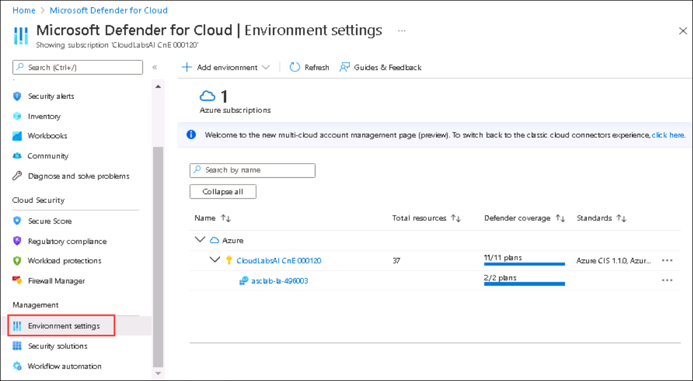
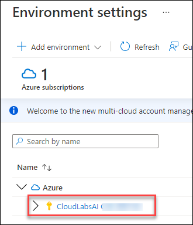
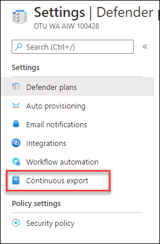
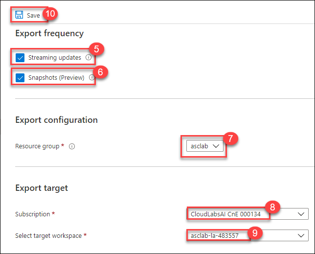
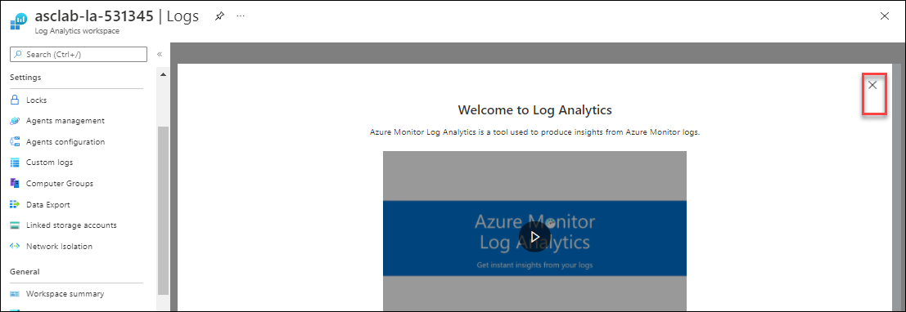
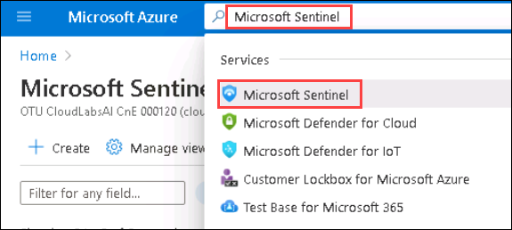
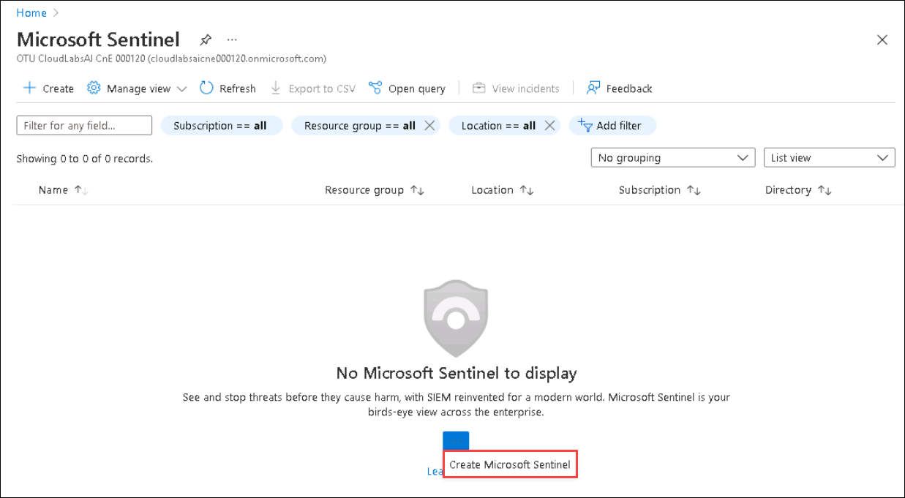

# Module 7 – Exporting Microsoft Defender for Cloud information to a SIEM

## Overview

In this module, you will configure the continuous export for Log Analytics workspace, exporting security alerts, recommendations, secure score, and security findings. Moreover, you will learn how to enable the integration between Microsoft Defender for Cloud and Microsoft Sentinel.

### Exercise 1: Using continuous export

Microsoft Defender for Cloud generates detailed security alerts and recommendations. You can view them in the portal or through programmatic tools. You might also need to export some or all of this information for tracking with other monitoring tools in your environment.

Continuous export lets you fully customize what will be exported, and where it will go. Even though the feature is called continuous, there's also an option to export weekly snapshots of secure score or regulatory compliance data.

1. Type **Microsoft Defender for Cloud** in the search box located on the top of the **Azure Portal** page and click on it.

    

1. From **Microsoft Defender for Cloud** blade, Select **Environment settings**. Here you'll be able see the subscription.

    
    
1. Select **Your Subscription** under the Environment settings.

    

1. Under **Settings** section, click on **Continuous export**.

    

1. Here you can configure the streaming export setting of Microsoft Defender for cloud data to multiple export targets either Event Hub or Log Analytics workspace.

1. Select the **Log Analytics workspace (1)** option and follow the below steps:

    - Exported data types:

     - Check the box next to  **Security recommendations (2)**

     - Check the box next to **Secure score (3)**

     - Check the box next to **Security alerts (4)**

         
     
     - Export frequency:

     - Check the box next to **Streaming updates (5)** and **Snapshots (Preview) (6)**

     - Export configuration:

      - Resource group: Select **asclab (7)** from drop-down list

     - Export target:

      - Subscription : Select your **Subscription (8)**

      - Select target workspace: Select **asclab-la-{DeploymentID} (9)**

     -  Click on **Save (10)**

        

     > **Note:** Exporting Microsoft Defender for Cloud's data also enables you to use experiences such as integration with 3rd-party SIEM and Azure Data Explorer.

1. Search for **Log Analytics workspaces** in the search box located on the top of the **Azure Portal** page and click on it or [click here](https://portal.azure.com/#blade/HubsExtension/BrowseResource/resourceType/Microsoft.OperationalInsights%2Fworkspaces).

1. Click on the **asclab-la-{DeploymentID} (1)** workspace and select **Logs(2)** button under the **General** section.

     

1. On the welcome page, close the **Queries** window.

    
    
     

1. From the left pane select the **Tables** tab and **enable** the **Show tables with no data** option to see the following tables: `SecurityEvent`, `SecurityBaseline`, `SecurityBaselineSummary` and  `UpdateSummary` in `Security and Audit`.

    

1. Query the tables to validate data streaming - For example, Click on **Tables (1)** expand **Security and Audit (2)** double click on **Security Event (3)** to open in the query window. Now click on **Run (4)** and see the results below.

    
  
   > **Note:** Since the continuous export was just enabled, you may need to wait for sometime for new events to show up.

### Exercise 2: Integration with Microsoft Sentinel

Integration with Microsoft Sentinel will enable centralized monitoring of alerts and discovery data. Integrating with Microsoft Sentinel allows you to better protect your cloud applications while maintaining your usual security workflow, automating security procedures, and correlating between cloud-based and on-premises events.

1. Search for **Microsoft Sentinel** in the search box located on the top of the **Azure Portal** page and click on it or [click here](https://portal.azure.com/#blade/Microsoft_Azure_Security_Insights/WorkspaceSelectorBlade).

    

2. On the **Microsoft Sentinel** blade, click on the **Create Microsoft Sentinel** button – for this exercise, we’ll use the same Log Analytics workspace used by Microsoft Defender for Cloud.
 
    

3. On the **Add Microsoft Sentinel to a workspace**, select **asclab-la-{DeploymentID}** workspace. Click on **Add**.

    

4. Adding Microsoft Sentinel to workspace asclab-la-{DeploymentID} is now in progress. This process will take few minutes to complete. 

5. Once the deployment is completed, you will be directly redirected to Microsoft Sentinel.

7. From Microsoft Sentinel side pane, click on the **Data connectors** under the **Configuration** section.

    
    

8. On the **Data connectors** page, use the search field and type: *Microsoft Defender*. Select the **Microsoft Defender for Cloud** connector and then click on **Open connector page**.

    

9. On the Configuration section, locate **Your subscription** and change the toggle button to **Connected**.

    

10. On the Create incidents (recommended) click on the **Enable** button to create incidents automatically from all alerts generated in this connected service.

     
 
    > **Note:** You may have to scroll down to find the option.

### Summary

In this lab you have completed configuring continuous export for Log Analytics workspace, exporting security alerts, recommendations, secure score, and security findings and enable the integration between Microsoft Defender for Cloud and Microsoft Sentinel.

Now you can move on to the next module by clicking on the Next button at the bottom right of the screen.
